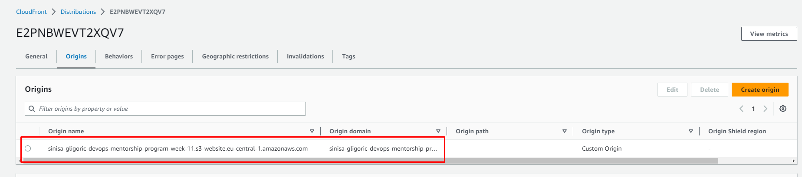

# week-10-static-website-s3-cloudfront
### Notes below are captured during solving TASK-9: Static website with S3 and CloudFront
----------------------------------------------------------------------------------

1. Created `static` directory and added custom `index.html`, `error.html` and `dev_ops.png` files. 

2. Created S3 bucket `sinisa-gligoric-devops-mentorship-program-week-11` in eu-central-1 and uploaded previously created files for static website. Enabled public access, enabled bucket versioning and enabled static website hosting option. 

3. Configured bucket policy in order to allow public access to all S3 bucket objects. 
```
{
    "Version": "2012-10-17",
    "Id": "s3PublicAccessPolicy",
    "Statement": [
        {
            "Sid": "AllowPublicAccess",
            "Effect": "Allow",
            "Principal": "*",
            "Action": "s3:GetObject",
            "Resource": "arn:aws:s3:::sinisa-gligoric-devops-mentorship-program-week-11/*"
        }
    ]
}
```

4. S3 bucket website endpoint publicly accessible via http://sinisa-gligoric-devops-mentorship-program-week-11.s3-website.eu-central-1.amazonaws.com/ 


5. Before creating CloudFront distribution, we need to generate Amazon SSL certificate using AWS Certificate Manager because certificate needs to be located in us-east-1 region in order to use it with CloudFront. Created Amazon issued SSL certificate in us-east-1 and verified ownership of domain name `www.sinisa-gligoric.awsbosnia.com` via DNS challenge:
* `aws route53 change-resource-record-sets --hosted-zone-id Z3LHP8UIUC8CDK --change-batch '{"Changes":[{"Action":"CREATE","ResourceRecordSet":{"Name":"_70d85e7aee91a511640fc37bae950033.www.sinisa-gligoric.awsbosnia.com.","Type":"CNAME","TTL":60,"ResourceRecords":[{"Value":"_a9e4a3ab78432fd9c134b958f1dbaaa3.tctzzymbbs.acm-validations.aws."}]}}]}' --profile aws-bosnia`


6. Created CloudFront distribution with Origin domain that points to S3 bucket website endpoint `http://sinisa-gligoric-devops-mentorship-program-week-11.s3-website.eu-central-1.amazonaws.com/`, Name `sinisa-gligoric-devops-mentorship-program-week-11.s3-website.eu-central-1.amazonaws.com`, Viewer protocol policy `Redirect HTTP to HTTPS`, attached previously generated Amazon SSL certficate and specified alternate domain name (CNAME) that will be used to access website through URL `www.sinisa-gligoric.awsbosnia.com` for the files served by this distribution.





7. Created DNS CNAME record `www.sinisa-gligoric.awsbosnia.com` inside Hosted Zone `awsbosnia.com` with `Hosted Zone ID: Z3LHP8UIUC8CDK` through access credentials inside named profile `aws-bosnia` located at `~/.aws/credentials` to point to CloudFront distribution name `d1djhi2bjy2ena.cloudfront.net`, via following command:
* `aws route53 change-resource-record-sets --hosted-zone-id Z3LHP8UIUC8CDK --change-batch '{"Changes":[{"Action":"CREATE","ResourceRecordSet":{"Name":"www.sinisa-gligoric.awsbosnia.com","Type":"CNAME","TTL":60,"ResourceRecords":[{"Value":"d1djhi2bjy2ena.cloudfront.net"}]}}]}' --profile aws-bosnia`.

8. Verify that DNS CNAME record is propagated correctly via following command:
* `aws route53 list-resource-record-sets --hosted-zone-id Z3LHP8UIUC8CDK  --profile aws-bosnia | jq '.ResourceRecordSets[] | select(.Name == "www.sinisa-gligoric.awsbosnia.com" and .Type == "CNAME") | {Name, Type, TTL, Value}'`

OR

* `dig www.sinisa-gligoric.awsbosnia.com CNAME +noall +answer `


9. Tested SSL certificate information and expiration date via openssl command:
* `sudo openssl s_client -connect www.sinisa-gligoric.awsbosnia.com:443 -state | openssl x509 -noout -dates`


10. URL `www.sinisa-gligoric.awsbosnia.com` accessible via browser:


### END

