# week-12-serverless-and-application-services
### Notes below are captured during solving TASK-10: Serverless and Application Services
----------------------------------------------------------------------------------
## Chapters below are from AWS Certified Solutions Architect - Associate (SAA-C03) course by Adrian Cantrill available on [learn.cantrill.io](https://learn.cantrill.io)
### 1. Architecture Deep Dive Part 1
In this lesson we step through how a video uploading architecture 'CatTube' can be evolved from monolithic to tiered.
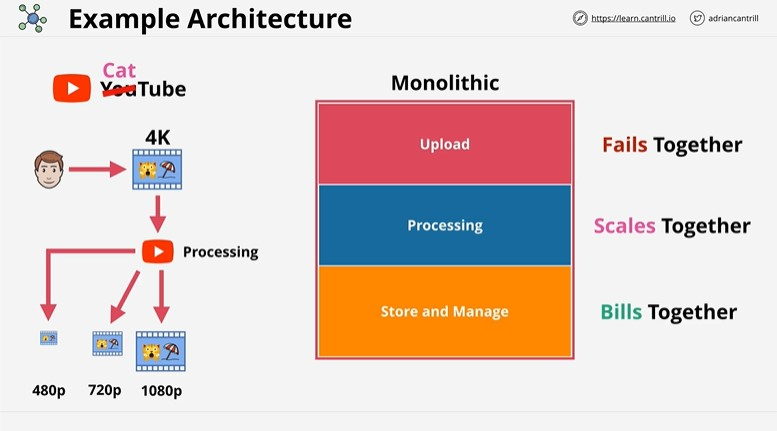
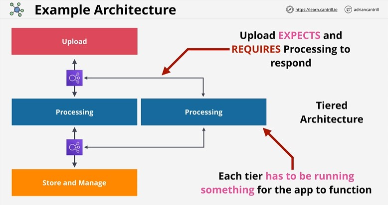

 ### 2. Architecture Deep Dive Part 2
 Part 2 continues by looking at evolutions using a queue based design, to achieve improved asynchronous communications and scaling and finishes by looking at microservices and event driven architectures.
 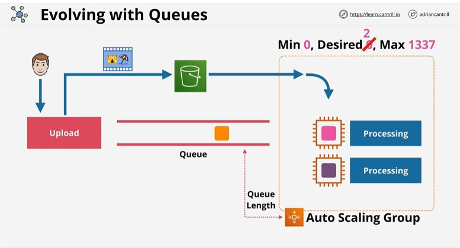
 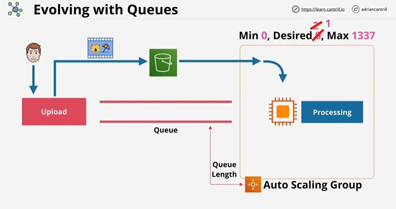
 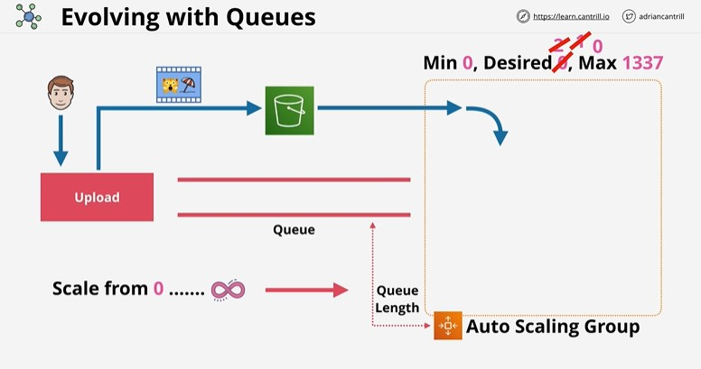
 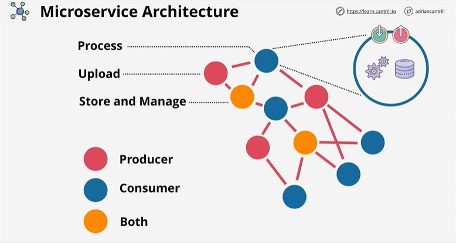
 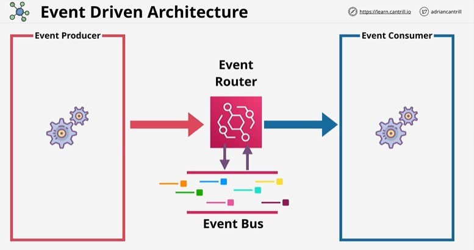
 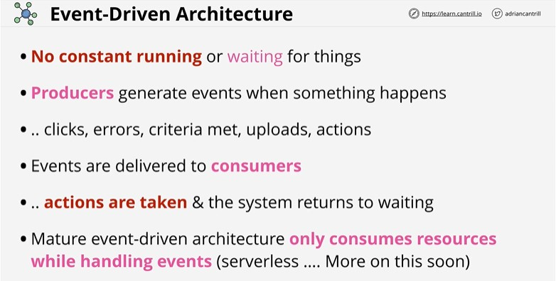

 ### 3. AWS Lambda Part 1
Part 1 is a refresher of the topics covered at an associate level with some additional detail.
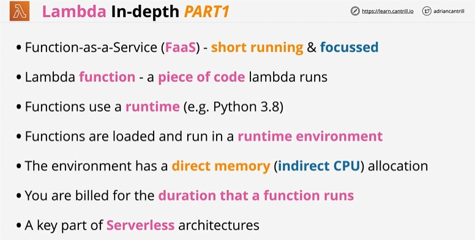
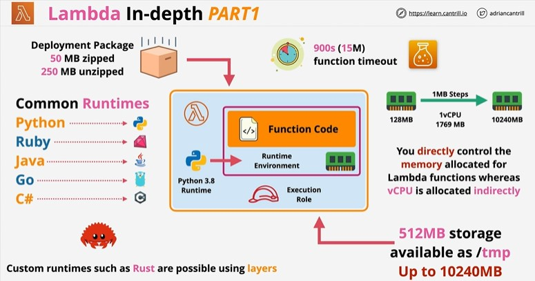
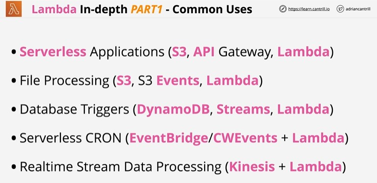
 ### 4. AWS Lambda Part 2
 Part 2 looks at public & VPC networking, security and logging.
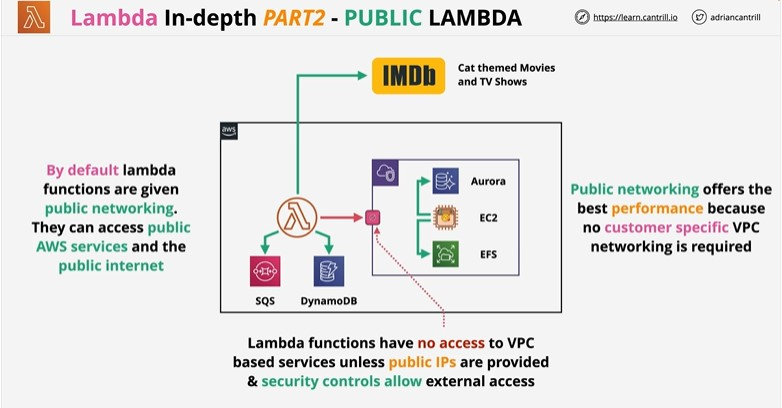
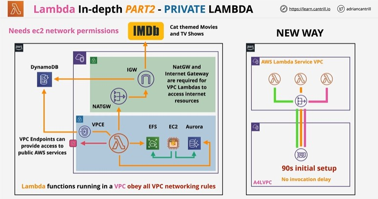
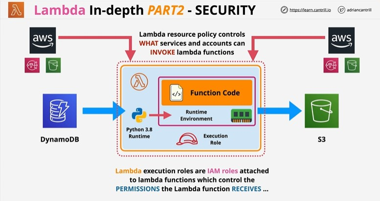
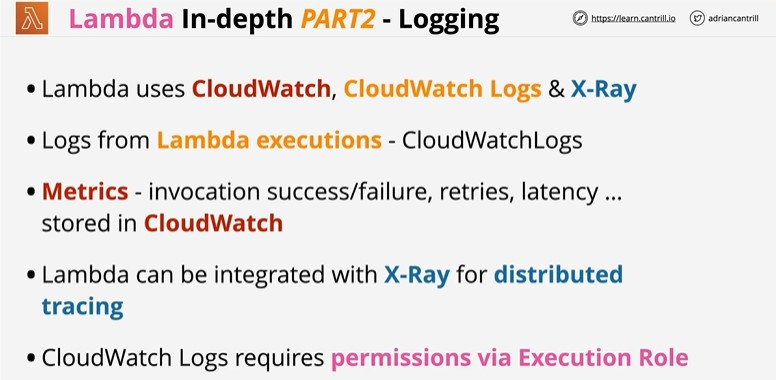
 ### 5. AWS Lambda Part 3
 Part 3 looks at invocation modes, versions & aliases, Latency, destinations and execution context.
 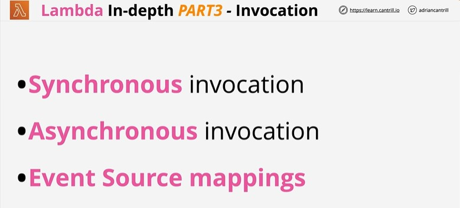
 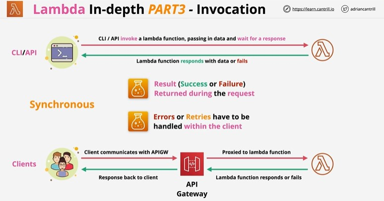
 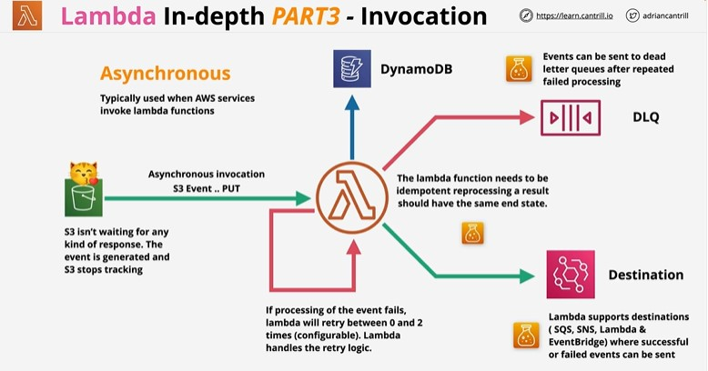
 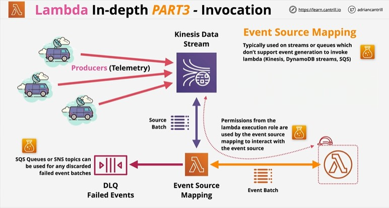
 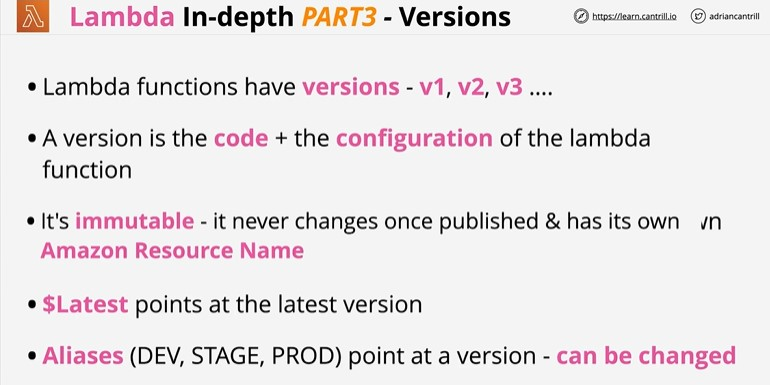
 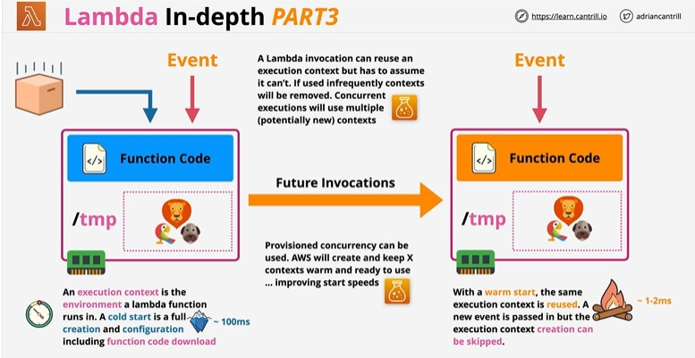
 ### 6. CloudWatchEvents and Event Bridge
 CloudWatch Events and EventBridge have visibility over events generated by supported AWS services within an account.

They can monitor the default account event bus - and pattern match events flowing through and deliver these events to multiple targets.

They are also the source of scheduled events which can perform certain actions at certain times of day, days of the week, or multiple combinations of both - using the Unix CRON time expression format.

Both services are one way how event driven architectures can be implemented within AWS.

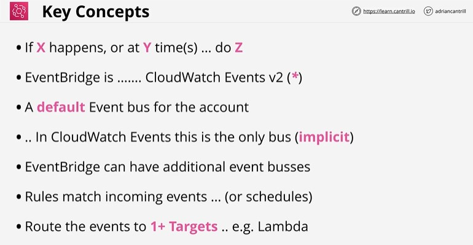
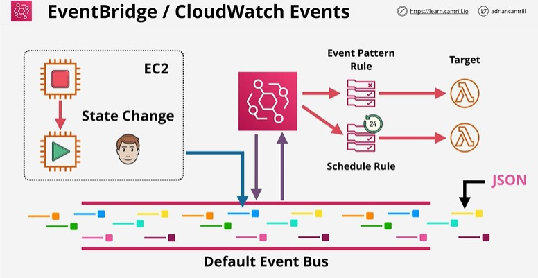

 ### 7. Automated EC2 Control using lambda and events Part 1 (DEMO)
 I have created two EC2 instances `A4L-Instance1` and `A4L-Instance2` by creating stack `TWOEC2` inside CloudFormation and executing following template in a form of yaml file.
 ```
 Parameters:
  LatestAmiId:
    Type: 'AWS::SSM::Parameter::Value<AWS::EC2::Image::Id>'
    Default: '/aws/service/ami-amazon-linux-latest/amzn2-ami-hvm-x86_64-gp2'
Resources:
  Instance1:
    Type: AWS::EC2::Instance
    Properties:
      InstanceType: "t2.micro"
      ImageId: !Ref LatestAmiId
      Tags:
        - Key: Name
          Value: A4L-Instance1
  Instance2:
    Type: AWS::EC2::Instance
    Properties:
      InstanceType: "t2.micro"
      ImageId: !Ref LatestAmiId
      Tags:
        - Key: Name
          Value: A4L-Instance2
 ```
  Before creating lambda functions, we have to assing lambda execution role permission policy so that lambda can log events inside CloudWatch Logs and start/stop EC2 instances. We have to go to IAM -> Roles -> Create Role -> Select AWS Service -> Select Lambda and create policy:
  ```
  {
  "Version": "2012-10-17",
  "Statement": [
    {
      "Effect": "Allow",
      "Action": [
        "logs:CreateLogGroup",
        "logs:CreateLogStream",
        "logs:PutLogEvents"
      ],
      "Resource": "arn:aws:logs:*:*:*"
    },
    {
      "Effect": "Allow",
      "Action": [
        "ec2:Start*",
        "ec2:Stop*"
      ],
      "Resource": "*"
    }
  ]
}
  ```
  Give the policy name LambdaStartAndStop and create role LambdaStartAndStopRole.

  In this chpater, I have created two different lambda functions that will interact with EC2 instances. First lambda function named `EC2Stop`/ `01_lambda_instance_stop.py` will stop the EC2 instances. We have to select Python 3.9 as a runtime environment and attach previously created execution role.
  Now we have to deploy lambda function. 
  ```
import boto3
import os
import json

region = 'eu-central-1'
ec2 = boto3.client('ec2', region_name=region)

def lambda_handler(event, context):
    instances=os.environ['EC2_INSTANCES'].split(",")
    ec2.stop_instances(InstanceIds=instances)
    print('stopped instances: ' + str(instances))

  ```
  In order to forward EC2 instance IDs, we have to go to Lambda -> Configuration -> Environment Variables and create environment variable with Key: EC2_INSTANCES Value:i-0bcf75b836712aefd,i-049e74734feb80950.
  Now go to Test and click Test to start executing lambda function. 

  Second lambda function named `EC2Start`/`02_lambda_instance_start.py` will start previously stopped EC2 instances. We have to select Python 3.9 as a runtime environment and attach previously created execution role.
  Now we have to deploy lambda function.  
  ```
import boto3
import os
import json

region = 'eu-central-1'
ec2 = boto3.client('ec2', region_name=region)

def lambda_handler(event, context):
    instances=os.environ['EC2_INSTANCES'].split(",")
    ec2.start_instances(InstanceIds=instances)
    print('started instances: ' + str(instances))
  ```
  In order to forward EC2 instance IDs, we have to go to Lambda -> Configuration -> Environment Variables and create environment variable with Key: EC2_INSTANCES Value:i-0bcf75b836712aefd,i-049e74734feb80950.
  Now go to Test and click Test to start executing lambda function. 
  
  
  
 ### 8. Automated EC2 Control using lambda and events Part 2 (DEMO)

 In this chpater, I have created lambda function `EC2Protect`/ `03_lambda_instance_protect.py` that will prevent EC2 instances from stopping (so it's going to look for EC2 instance state and if it becomes stopped, lambda function will automatically start those EC2 instances). We have to select Python 3.9 as a runtime environment and attach previously created execution role.
  Now we have to deploy lambda function.  
  ```
import boto3
import os
import json

region = 'eu-central-1'
ec2 = boto3.client('ec2', region_name=region)

def lambda_handler(event, context):
    print("Received event: " + json.dumps(event))
    instances=[ event['detail']['instance-id'] ]
    ec2.start_instances(InstanceIds=instances)
    print ('Protected instance stopped - starting up instance: '+str(instances))
  ```
This time we will not provide EC2 instance IDs manually as environment variables, but we will create EventBridge rule that will monitor Event Bus for currently used account and whenever it detects that EC2 instance is going into stopped state, it will trigger this rule and pass that event to target to our lambda function that will start that EC2 instance immediately.

So we have to go to Amazon EventBridge and define rule `EC2Protect`. Under Event pattern, we have to select AWS service: EC2, Event type: EC2 Instance State-change Notification and also change Specific state(s): stopped. Click Next and select lambda function EC2Protect as target and create rule. 

Now if we try to stop EC2 instances, as soon as EventBridge rule detects EC2 instances stopped state, it will invoke lambda function `EC2Protect` and start those stopped instances.

 ### 9. Serverless Architecture
 
 ### 10. Simple Notification Service (SNS)
 ### 11. Step Functions
 ### 12. API Gateway 101
 ### 13. Build a serverless app part 1
 ### 14. Build a serverless app part 2
 ### 15. Build a serverless app part 3
 ### 16. Build a serverless app part 4
 ### 17. Build a serverless app part 5
 ### 18. Build a serverless app part 6
 ### 19. Simple Queue Service (SQS)
 ### 20. SQS Stadanard vs FIFO Queus
 ### 21. SQS Delay Queues


### END

