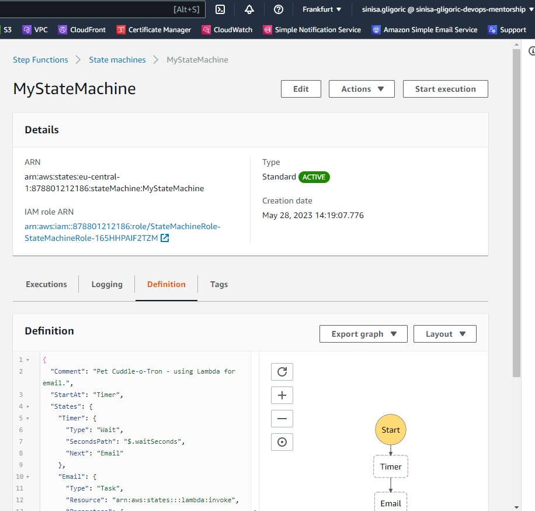

# week-12-serverless-and-application-services
### Notes below are captured during solving TASK-10: Serverless and Application Services
----------------------------------------------------------------------------------
## Chapters below are from AWS Certified Solutions Architect - Associate (SAA-C03) course by Adrian Cantrill available on [learn.cantrill.io](https://learn.cantrill.io)

-----------------------------------------
 
### 1. Architecture Deep Dive Part 1
In this lesson we step through how a video uploading architecture 'CatTube' can be evolved from monolithic to tiered.


-----------------------------------------
 
 ### 2. Architecture Deep Dive Part 2
 Part 2 continues by looking at evolutions using a queue based design, to achieve improved asynchronous communications and scaling and finishes by looking at microservices and event driven architectures.

 
 
 
 
 
 

-----------------------------------------
 
 ### 3. AWS Lambda Part 1
Part 1 is a refresher of the topics covered at an associate level with some additional detail.


-----------------------------------------
 
 ### 4. AWS Lambda Part 2
 Part 2 looks at public & VPC networking, security and logging.


-----------------------------------------
 
 ### 5. AWS Lambda Part 3
 Part 3 looks at invocation modes, versions & aliases, Latency, destinations and execution context.
 
 
 
 
 
 
 
-----------------------------------------
 
 ### 6. CloudWatchEvents and Event Bridge
 CloudWatch Events and EventBridge have visibility over events generated by supported AWS services within an account.

They can monitor the default account event bus - and pattern match events flowing through and deliver these events to multiple targets.

They are also the source of scheduled events which can perform certain actions at certain times of day, days of the week, or multiple combinations of both - using the Unix CRON time expression format.

Both services are one way how event driven architectures can be implemented within AWS.


-----------------------------------------
 
 ### 7. Automated EC2 Control using lambda and events Part 1 (DEMO)
 I have created two EC2 instances `A4L-Instance1` and `A4L-Instance2` by creating stack `TWOEC2` inside CloudFormation and executing following template in a form of yaml file.
 ```
 Parameters:
  LatestAmiId:
    Type: 'AWS::SSM::Parameter::Value<AWS::EC2::Image::Id>'
    Default: '/aws/service/ami-amazon-linux-latest/amzn2-ami-hvm-x86_64-gp2'
Resources:
  Instance1:
    Type: AWS::EC2::Instance
    Properties:
      InstanceType: "t2.micro"
      ImageId: !Ref LatestAmiId
      Tags:
        - Key: Name
          Value: A4L-Instance1
  Instance2:
    Type: AWS::EC2::Instance
    Properties:
      InstanceType: "t2.micro"
      ImageId: !Ref LatestAmiId
      Tags:
        - Key: Name
          Value: A4L-Instance2
 ```
  Before creating lambda functions, we have to assing lambda execution role permission policy so that lambda can log events inside CloudWatch Logs and start/stop EC2 instances. We have to go to IAM -> Roles -> Create Role -> Select AWS Service -> Select Lambda and create policy:
  ```
  {
  "Version": "2012-10-17",
  "Statement": [
    {
      "Effect": "Allow",
      "Action": [
        "logs:CreateLogGroup",
        "logs:CreateLogStream",
        "logs:PutLogEvents"
      ],
      "Resource": "arn:aws:logs:*:*:*"
    },
    {
      "Effect": "Allow",
      "Action": [
        "ec2:Start*",
        "ec2:Stop*"
      ],
      "Resource": "*"
    }
  ]
}
  ```
  Give the policy name LambdaStartAndStop and create role LambdaStartAndStopRole.

  In this chpater, I have created two different lambda functions that will interact with EC2 instances. First lambda function named `EC2Stop`/ `01_lambda_instance_stop.py` will stop the EC2 instances. We have to select Python 3.9 as a runtime environment and attach previously created execution role.
  Now we have to deploy lambda function. 
  ```
import boto3
import os
import json

region = 'eu-central-1'
ec2 = boto3.client('ec2', region_name=region)

def lambda_handler(event, context):
    instances=os.environ['EC2_INSTANCES'].split(",")
    ec2.stop_instances(InstanceIds=instances)
    print('stopped instances: ' + str(instances))

  ```
  In order to forward EC2 instance IDs, we have to go to Lambda -> Configuration -> Environment Variables and create environment variable with Key: EC2_INSTANCES Value:i-0bcf75b836712aefd,i-049e74734feb80950.
  Now go to Test and click Test to start executing lambda function. 

  Second lambda function named `EC2Start`/`02_lambda_instance_start.py` will start previously stopped EC2 instances. We have to select Python 3.9 as a runtime environment and attach previously created execution role.
  Now we have to deploy lambda function.  
  ```
import boto3
import os
import json

region = 'eu-central-1'
ec2 = boto3.client('ec2', region_name=region)

def lambda_handler(event, context):
    instances=os.environ['EC2_INSTANCES'].split(",")
    ec2.start_instances(InstanceIds=instances)
    print('started instances: ' + str(instances))
  ```
  In order to forward EC2 instance IDs, we have to go to Lambda -> Configuration -> Environment Variables and create environment variable with Key: EC2_INSTANCES Value:i-0bcf75b836712aefd,i-049e74734feb80950.
  Now go to Test and click Test to start executing lambda function. 
  
  
-----------------------------------------
 
 ### 8. Automated EC2 Control using lambda and events Part 2 (DEMO)

 In this chpater, I have created lambda function `EC2Protect`/ `03_lambda_instance_protect.py` that will prevent EC2 instances from stopping (so it's going to look for EC2 instance state and if it becomes stopped, lambda function will automatically start those EC2 instances). We have to select Python 3.9 as a runtime environment and attach previously created execution role.
  Now we have to deploy lambda function.  
  ```
import boto3
import os
import json

region = 'eu-central-1'
ec2 = boto3.client('ec2', region_name=region)

def lambda_handler(event, context):
    print("Received event: " + json.dumps(event))
    instances=[ event['detail']['instance-id'] ]
    ec2.start_instances(InstanceIds=instances)
    print ('Protected instance stopped - starting up instance: '+str(instances))
  ```
This time we will not provide EC2 instance IDs manually as environment variables, but we will create EventBridge rule that will monitor Event Bus for currently used account and whenever it detects that EC2 instance is going into stopped state, it will trigger this rule and pass that event to target to our lambda function that will start that EC2 instance immediately.

So we have to go to Amazon EventBridge and define rule `EC2Protect`. Under Event pattern, we have to select AWS service: EC2, Event type: EC2 Instance State-change Notification and also change Specific state(s): stopped. Click Next and select lambda function EC2Protect as target and create rule. 

Now if we try to stop EC2 instances, as soon as EventBridge rule detects EC2 instances stopped state, it will invoke lambda function `EC2Protect` and start those stopped instances.

-----------------------------------------
 
 ### 9. Serverless Architecture
 The Serverless architecture is a evolution/combination of other popular architectures such as event-driven and microservices.

It aims to use 3rd party services where possible and FAAS products for any on-demand computing needs.

Using a serverless architecture means little to no base costs for an environment - and any cost incurred during operations scale in a way with matches the incoming load.

Serverless starts to feature more and more on the AWS exams - so its a critical architecture to understand.

 
 

-----------------------------------------
 
 ### 10. Simple Notification Service (SNS)
 The Simple Notification Service or SNS .. is a PUB SUB style notification system which is used within AWS products and services but can also form an essential part of serverless, event-driven and traditional application architectures.

Publishers send messages to TOPICS

Subscribers receive messages SENT to TOPICS.

SNS supports a wide variety of subscriber types including other AWS services such as LAMBDA and SQS.


-----------------------------------------
 
 ### 11. Step Functions
 Step functions is a product which lets you build long running serverless workflow based applications within AWS which integrate with many AWS services.

 
 
 
 

-----------------------------------------
 
 ### 12. API Gateway 101
 API Gateway is a managed service from AWS which allows the creation of API Endpoints, Resources & Methods.

The API gateway integrates with other AWS services - and can even access some without the need for dedicated compute.

It serves as a core component of many serverless architectures using Lambda as event-driven and on-demand backing for methods.

It can also connect to legacy monolithic applications and act as a stable API endpoint during an evolution from a monolith to microservices and potentially through to serverless.
[https://docs.aws.amazon.com/apigateway/latest/api/CommonErrors.html](https://docs.aws.amazon.com/apigateway/latest/api/CommonErrors.html)


-----------------------------------------
 
 ### 13. Build a serverless app part 1
 In this DEMO we will be implementing a serverless reminder application.

The application will load from an S3 bucket and run in browser

.. communicating with Lambda and Step functions via an API Gateway Endpoint.

Using the application we will be able to configure reminders for 'pet cuddles' to be send using email and SMS.


This demo consists of 6 stages :-

- STAGE 1 : Configure Simple Email service & SNS

- STAGE 2 : Add a email lambda function to use SES to send emails for the serverless application

- STAGE 3 : Implement and configure the state machine, the core of the application

- STAGE 4 : Implement the API Gateway, API and supporting lambda function

- STAGE 5 : Implement the static frontend application and test functionality

- STAGE 6 : Cleanup the account

-------------------------------------
STAGE 1 : Configure Simple Email service & SNS.


First we have to configure email addresseses (from and to) going into Amazon SES -> Verified identities -> Create identity -> Email address. The email address I am using from which email will be sent is `sinisagligoric98@gmail.com` and email address to which email will be sent is `lakbjsqbpr@enhancedzoom.com`.
After creating verified identities, we have to click on verifiation link send to those emails. 

-----------------------------------------
 
 ### 14. Build a serverless app part 2
 STAGE 2 : Add a email lambda function to use SES to send emails for the serverless application.


Before creating lambda functions, we have to create lambda IAM execution role and assing permission policy so that lambda can log events inside CloudWatch Logs and also that can perform actions on ses:*, sns:* and states:*. States means that lambda function can interact with state machines inside step functions. We will do that by executing CloudFormation stack using yaml file below:
```
Resources:
  LambdaRole:
    Type: AWS::IAM::Role
    Properties:
      AssumeRolePolicyDocument:
        Statement:
          - Action:
            - sts:AssumeRole
            Effect: Allow
            Principal:
              Service:
              - lambda.amazonaws.com
        Version: 2012-10-17
      Path: /
      Policies: 
        - PolicyName: cloudwatchlogs
          PolicyDocument:
            Version: 2012-10-17
            Statement:
              - Effect: Allow
                Action:
                  - "logs:CreateLogGroup"
                  - "logs:CreateLogStream"
                  - "logs:PutLogEvents"
                Resource: "arn:aws:logs:*:*:*"
        - PolicyName: snsandsespermissions
          PolicyDocument:
            Version: 2012-10-17
            Statement:
              - Effect: Allow
                Action:
                  - "ses:*"
                  - "sns:*"
                  - "states:*"
                Resource: '*'

```


Then, I have created email remainder lambda function named `email_remainder_lambda`. We have to select Python 3.9 as a runtime environment and attach previously created execution role.

Now we have to deploy lambda function and change FROM_EMAIL_ADDRESS = "REPLACE_ME" to "sinisagligoric98@gmail.com".
```
import boto3, os, json

FROM_EMAIL_ADDRESS = 'sinisagligoric98@gmail.com'

ses = boto3.client('ses')

def lambda_handler(event, context):
    # Print event data to logs .. 
    print("Received event: " + json.dumps(event))
    # Publish message directly to email, provided by EmailOnly or EmailPar TASK
    ses.send_email( Source=FROM_EMAIL_ADDRESS,
        Destination={ 'ToAddresses': [ event['Input']['email'] ] }, 
        Message={ 'Subject': {'Data': 'Whiskers Commands You to attend!'},
            'Body': {'Text': {'Data': event['Input']['message']}}
        }
    )
    return 'Success!'
```

-----------------------------------------
 
 ### 15. Build a serverless app part 3
 STAGE 3 : Implement and configure the state machine, the core of the application.

 

Before configuring state machine, we have to create IAM role with attached policies using CloudFormation stack in a form of yaml file below:
```
Resources:
  StateMachineRole:
    Type: AWS::IAM::Role
    Properties:
      AssumeRolePolicyDocument:
        Statement:
          - Action:
            - sts:AssumeRole
            Effect: Allow
            Principal:
              Service:
              - states.amazonaws.com
        Version: 2012-10-17
      Path: /
      Policies: 
        - PolicyName: cloudwatchlogs
          PolicyDocument:
            Version: 2012-10-17
            Statement:
              - Effect: Allow
                Action:
                  - "logs:CreateLogGroup"
                  - "logs:CreateLogStream"
                  - "logs:PutLogEvents"
                  - "logs:CreateLogDelivery"
                  - "logs:GetLogDelivery"
                  - "logs:UpdateLogDelivery"
                  - "logs:DeleteLogDelivery"
                  - "logs:ListLogDeliveries"
                  - "logs:PutResourcePolicy"
                  - "logs:DescribeResourcePolicies"
                  - "logs:DescribeLogGroups"
                Resource: "*"
        - PolicyName: invokelambdasandsendSNS
          PolicyDocument:
            Version: 2012-10-17
            Statement:
              - Effect: Allow
                Action:
                  - "lambda:InvokeFunction"
                  - "sns:*"
                Resource: '*'
```


Next, I have created state machine via Step Functions -> Create state machine -> Write your workflow in code -> Standard (has maximum execution time of 1 year). Then, inside definition of state machine, we will provide code in Amazon States Language (ASL) format that is similar to JSON, in order to create state machine that will wait for certain time defined by timer and invoke lambda function `email_remainder_lambda`to send email via SES. Inside ASL code below, we need to change EMAIL_LAMBDA_ARN with arn of lambda function `email_remainder_lambda`. 

```
{
  "Comment": "Pet Cuddle-o-Tron - using Lambda for email.",
  "StartAt": "Timer",
  "States": {
    "Timer": {
      "Type": "Wait",
      "SecondsPath": "$.waitSeconds",
      "Next": "Email"
    },
    "Email": {
      "Type" : "Task",
      "Resource": "arn:aws:states:::lambda:invoke",
      "Parameters": {
        "FunctionName": "arn:aws:lambda:eu-central-1:878801212186:function:email_remainder_lambda",
        "Payload": {
          "Input.$": "$"
        }
      },
      "Next": "NextState"
    },
    "NextState": {
      "Type": "Pass",
      "End": true
    }
  }
}
```
After that, click Next and specify the name of state machine and attach previously created IAM role. Under Logging, change Log level from OFF to ALL to allow state machine to log execution details to CloudWatch logs. 



-----------------------------------------
 
 ### 16. Build a serverless app part 4
 STAGE 4 : Implement the API Gateway, API and supporting lambda function.


I have created lambda function that is going to support API Gateway, named `api_lambda`. We have to select Python 3.9 as a runtime environment and attach previously created IAM execution role.

Now we have to deploy lambda function and change SM_ARN = "YOUR_STATEMACHINE_ARN" to "arn:aws:states:eu-central-1:878801212186:stateMachine:MyStateMachine".

```
# This code is a bit ...messy and includes some workarounds
# It functions fine, but needs some cleanup
# Checked the DecimalEncoder and Checks workarounds 20200402 and no progression towards fix

import boto3, json, os, decimal

SM_ARN = 'arn:aws:states:eu-central-1:878801212186:stateMachine:MyStateMachine'

sm = boto3.client('stepfunctions')

def lambda_handler(event, context):
    # Print event data to logs .. 
    print("Received event: " + json.dumps(event))

    # Load data coming from APIGateway
    data = json.loads(event['body'])
    data['waitSeconds'] = int(data['waitSeconds'])
    
    # Sanity check that all of the parameters we need have come through from API gateway
    # Mixture of optional and mandatory ones
    checks = []
    checks.append('waitSeconds' in data)
    checks.append(type(data['waitSeconds']) == int)
    checks.append('message' in data)

    # if any checks fail, return error to API Gateway to return to client
    if False in checks:
        response = {
            "statusCode": 400,
            "headers": {"Access-Control-Allow-Origin":"*"},
            "body": json.dumps( { "Status": "Success", "Reason": "Input failed validation" }, cls=DecimalEncoder )
        }
    # If none, start the state machine execution and inform client of 2XX success :)
    else: 
        sm.start_execution( stateMachineArn=SM_ARN, input=json.dumps(data, cls=DecimalEncoder) )
        response = {
            "statusCode": 200,
            "headers": {"Access-Control-Allow-Origin":"*"},
            "body": json.dumps( {"Status": "Success"}, cls=DecimalEncoder )
        }
    return response

# This is a workaround for: http://bugs.python.org/issue16535
# Solution discussed on this thread https://stackoverflow.com/questions/11942364/typeerror-integer-is-not-json-serializable-when-serializing-json-in-python
# https://stackoverflow.com/questions/1960516/python-json-serialize-a-decimal-object
# Credit goes to the group :)
class DecimalEncoder(json.JSONEncoder):
    def default(self, obj):
        if isinstance(obj, decimal.Decimal):
            return int(obj)
        return super(DecimalEncoder, self).default(obj)

```

Next step is creating API Gateway, API and method that our serverless app will use.

Under API Gateway, we will create REST API -> New API -> API name: petcuddleotron -> Endpoint Type: Regional.

After that, we will create `petcuddleotron` API resource under Resources -> Resource Name: petcuddleotron -> Enable API Gateway CORS: yes.

Next, we have to create method which is the actual point that our client app will directly comumnicate with. Under `petcuddleotron` resource click Actions -> Create method -> POST -> Integration type: Lambda Function -> Use Lambda Proxy Integration: yes -> Lambda Region: eu-central-1 -> Lambda Function: api_lambda -> Use Default Timeout: yes.

Final step is to deploy API. Click on Actions -> Deploy API -> Deployment stage: [New Stage] -> Stage name: prod, Stage description: prod.

API Gateway Invoke URL: https://snuqjn2bll.execute-api.eu-central-1.amazonaws.com/prod

-----------------------------------------
 
 ### 17. Build a serverless app part 5
 STAGE 5 : Implement the static frontend application and test functionality.


I have created S3 bucket named `petcuddleotron1998` in eu-central-1 region and we have to uncheck Block public access. In order to access bucket publicly, we have to create bucket policy and change "REPLACEME_PET_CUDDLE_O_TRON_BUCKET_ARN" with S3 bucket ARN. 

```
{
    "Version":"2012-10-17",
    "Statement":[
      {
        "Sid":"PublicRead",
        "Effect":"Allow",
        "Principal": "*",
        "Action":["s3:GetObject"],
        "Resource":["arn:aws:s3:::petcuddleotron1998/*"]
      }
    ]
  }
```
Next step is to enable static website hosting under S3 bucket Properties and specify Index and Error document to index.html both.

Next we have to edit JS file of our serverless frontend app to point to API Gateway Invoke URL + method created. 

```
var API_ENDPOINT = 'https://snuqjn2bll.execute-api.eu-central-1.amazonaws.com/prod/petcuddleotron';
// if correct it should be similar to https://somethingsomething.execute-api.us-east-1.amazonaws.com/prod/petcuddleotron

var errorDiv = document.getElementById('error-message')
var successDiv = document.getElementById('success-message')
var resultsDiv = document.getElementById('results-message')

// function output returns input button contents
function waitSecondsValue() { return document.getElementById('waitSeconds').value }
function messageValue() { return document.getElementById('message').value }
function emailValue() { return document.getElementById('email').value }

function clearNotifications() {
    errorDiv.textContent = '';
    resultsDiv.textContent = '';
    successDiv.textContent = '';
}

// When buttons are clicked, this is run passing values to API Gateway call
document.getElementById('emailButton').addEventListener('click', function(e) { sendData(e, 'email'); });

function sendData (e, pref) {
    e.preventDefault()
    clearNotifications()
    fetch(API_ENDPOINT, {
        headers:{
            "Content-type": "application/json"
        },
        method: 'POST',
        body: JSON.stringify({
            waitSeconds: waitSecondsValue(),
            message: messageValue(),
            email: emailValue()
        }),
        mode: 'cors'
    })
    .then((resp) => resp.json())
    .then(function(data) {
        console.log(data)
        successDiv.textContent = 'Submitted. But check the result below!';
        resultsDiv.textContent = JSON.stringify(data);
    })
    .catch(function(err) {
        errorDiv.textContent = 'Oops! Error Error:\n' + err.toString();
        console.log(err)
    });
};

```

After that I have uploaded serverless frontend app files to that S3 Bucket. 

To access our serverless frontend app click on S3 Bucket Properties and at the bottom is Bucket website endpoint. 

Enter 120 seconds for timer value, enter random message for human and enter destination email address that we specified previously in SES. 

If everything works successfully, after 120 seconds you should get an email.

-----------------------------------------
 
 ### 18. Build a serverless app part 6
 STAGE 6 : Cleanup the account.

 In this stage, I have deleted all previously created resources in order to prevent unwanted expenses.

-----------------------------------------
 
 ### 19. Simple Queue Service (SQS)
 SQS queues are a managed message queue service in AWS which help to decouple application components, allow Asynchronous messaging or the implementation of worker pools.

 
 
 
 

-----------------------------------------
 
 ### 20. SQS Stadanard vs FIFO Queues
 This lesson reviews the differences between Standard SQS Queues and First-In-First-Out (FIFO) SQS Queues.

 

-----------------------------------------
 
 ### 21. SQS Delay Queues
Delay queues provide an initial period of invisibility for messages. Predefine periods can ensure that processing of messages doesn't begin until this period has expired.

[https://docs.aws.amazon.com/AWSSimpleQueueService/latest/SQSDeveloperGuide/sqs-message-timers.html](https://docs.aws.amazon.com/AWSSimpleQueueService/latest/SQSDeveloperGuide/sqs-message-timers.html)
[https://docs.aws.amazon.com/AWSSimpleQueueService/latest/SQSDeveloperGuide/sqs-delay-queues.html](https://docs.aws.amazon.com/AWSSimpleQueueService/latest/SQSDeveloperGuide/sqs-delay-queues.html)
[https://docs.aws.amazon.com/AWSSimpleQueueService/latest/SQSDeveloperGuide/sqs-visibility-timeout.html](https://docs.aws.amazon.com/AWSSimpleQueueService/latest/SQSDeveloperGuide/sqs-visibility-timeout.html)


-----------------------------------------
### END

