# week-13-gitflow-workshop
### Notes below are captured during solving TASK-11: AWS Tools GitFlow Workshop on this [link](https://catalog.us-east-1.prod.workshops.aws/workshops/484a7839-1887-43e8-a541-a8c014cd5b18/en-US/introduction).
----------------------------------------------------------------------------------

 ## Branching models
 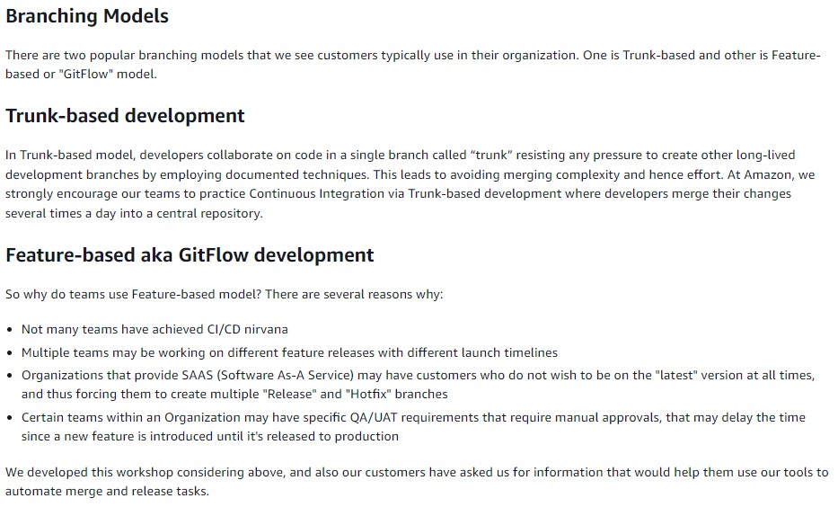
 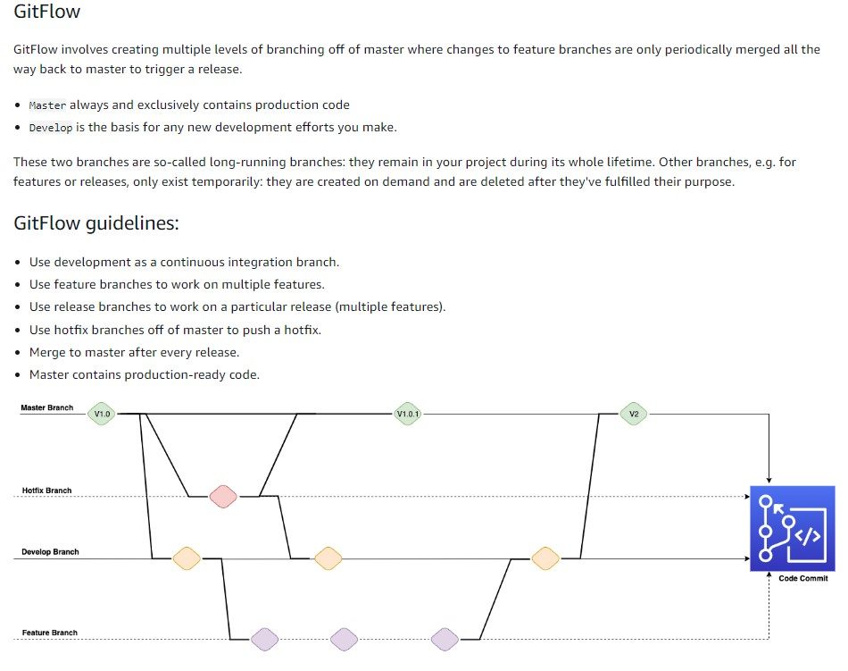

--------------------------------------------------------------

## Launching, accessing and setting up AWS Cloud9 in EU-CENTRAL-1

AWS Cloud9  is a cloud-based integrated development environment (IDE) that lets you write, run, and debug your code with just a browser. It includes a code editor, debugger, and terminal. Cloud9 comes prepackaged with essential tools for popular programming languages, including JavaScript, Python, PHP, and more, so you don’t need to install files or configure your development machine to start new projects. Since your Cloud9 IDE is cloud-based, you can work on your projects from your office, home, or anywhere using an internet-connected machine. Cloud9 also provides a seamless experience for developing serverless applications enabling you to easily define resources, debug, and switch between local and remote execution of serverless applications. With Cloud9, you can quickly share your development environment with your team, enabling you to pair program and track each other's inputs in real time.

- Sign in to AWS as the IAM user you've configured and open the AWS Cloud9 console.
- In the AWS Cloud9 console, choose Create environment.
- Select `Create environment`
- Name it `gitflow-workshop`, and take all other defaults
- When it comes up, customize the environment by closing the welcome tab and lower work area, and opening a new terminal tab in the main work area.
- By default the Amazon EBS volume attached to the Cloud9 instance is 10 GiB, let's confirm this by typing the following in the terminal `df -h`. We can see that /dev/xvda1 is 10 GiB and has around 4.1 GiB free. 4.1 GiB of free space isn't enough free space to run this workshop so we need to resize the attached Amazon EBS volume.
- From the Cloud9 terminal, create a file called resize.sh -> `touch resize.sh`. 
- Open resize.sh in Cloud9 and paste the bash script from the documentation:
```
#!/bin/bash

# Specify the desired volume size in GiB as a command line argument. If not specified, default to 20 GiB.
SIZE=${1:-20}

# Get the ID of the environment host Amazon EC2 instance.
INSTANCEID=$(curl http://169.254.169.254/latest/meta-data/instance-id)
REGION=$(curl -s http://169.254.169.254/latest/meta-data/placement/availability-zone | sed 's/\(.*\)[a-z]/\1/')

# Get the ID of the Amazon EBS volume associated with the instance.
VOLUMEID=$(aws ec2 describe-instances \
  --instance-id $INSTANCEID \
  --query "Reservations[0].Instances[0].BlockDeviceMappings[0].Ebs.VolumeId" \
  --output text \
  --region $REGION)

# Resize the EBS volume.
aws ec2 modify-volume --volume-id $VOLUMEID --size $SIZE

# Wait for the resize to finish.
while [ \
  "$(aws ec2 describe-volumes-modifications \
    --volume-id $VOLUMEID \
    --filters Name=modification-state,Values="optimizing","completed" \
    --query "length(VolumesModifications)"\
    --output text)" != "1" ]; do
sleep 1
done

#Check if we're on an NVMe filesystem
if [[ -e "/dev/xvda" && $(readlink -f /dev/xvda) = "/dev/xvda" ]]
then
  # Rewrite the partition table so that the partition takes up all the space that it can.
  sudo growpart /dev/xvda 1

  # Expand the size of the file system.
  # Check if we're on AL2
  STR=$(cat /etc/os-release)
  SUB="VERSION_ID=\"2\""
  if [[ "$STR" == *"$SUB"* ]]
  then
    sudo xfs_growfs -d /
  else
    sudo resize2fs /dev/xvda1
  fi

else
  # Rewrite the partition table so that the partition takes up all the space that it can.
  sudo growpart /dev/nvme0n1 1

  # Expand the size of the file system.
  # Check if we're on AL2
  STR=$(cat /etc/os-release)
  SUB="VERSION_ID=\"2\""
  if [[ "$STR" == *"$SUB"* ]]
  then
    sudo xfs_growfs -d /
  else
    sudo resize2fs /dev/nvme0n1p1
  fi
fi
```
- From the terminal execute the resize.sh bash script to resize the attached EBS volume to 30 GiB `bash resize.sh 30`. 
- Now check the size of the attached EBS volume `df -h`.

The following output should be produced:

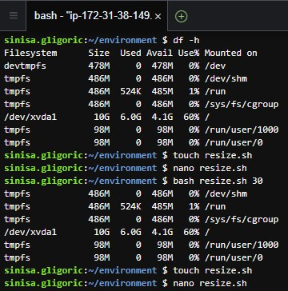

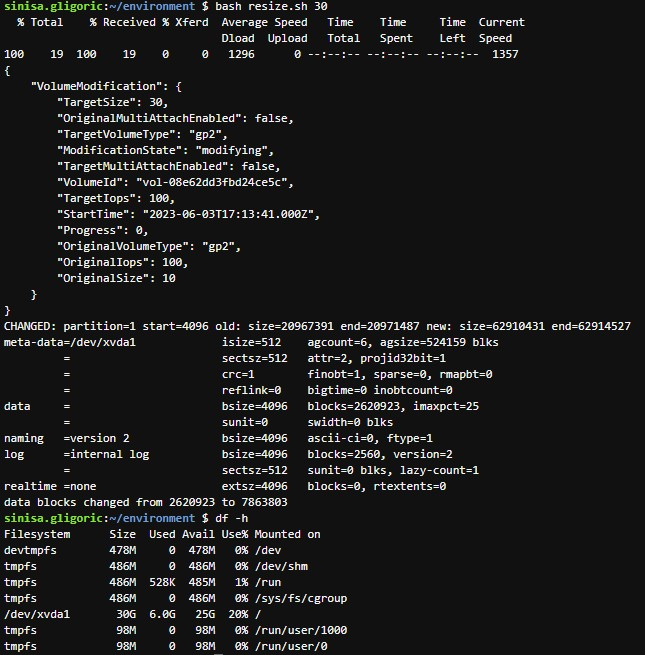


------------------------------------

## Initial Setup

The git config command is a convenience function that is used to set Git configuration values on a global or local project level. It is best practice to set up your git user.name and user.email when you set up a new Cloud9 environment using the following commands:

`git config --global user.name "Sinisa Gligoric"`

`git config --global user.email sinisagligoric98@gmail.com`

-------------------------------------------

## Configure the AWS CLI Credential Helper on Your AWS Cloud9 EC2 Development Environment

After you've created an AWS Cloud9 environment, you can configure the AWS CLI credential helper to manage the credentials for connections to your CodeCommit repository. The AWS Cloud9 development environment comes with AWS managed temporary credentials that are associated with your IAM user. You use these credentials with the AWS CLI credential helper. The credential helper allows Git to use HTTPS and a cryptographically signed version of your IAM user credentials or Amazon EC2 instance role whenever Git needs to authenticate with AWS to interact with CodeCommit repositories.

At the terminal, run the following commands to configure the AWS CLI credential helper for HTTPS connections:

`git config --global credential.helper '!aws codecommit credential-helper $@'`

`git config --global credential.UseHttpPath true`

-----------------------------------------

## Install gitflow

gitflow is a collection of Git extensions to provide high-level repository operations for Vincent Driessen's [branching model](https://nvie.com/posts/a-successful-git-branching-model/). At the terminal, run the following commands to install gitflow:

`curl -OL https://raw.github.com/nvie/gitflow/develop/contrib/gitflow-installer.sh`

`chmod +x gitflow-installer.sh`

`sudo git config --global url."https://github.com".insteadOf git://github.com`

`sudo ./gitflow-installer.sh`

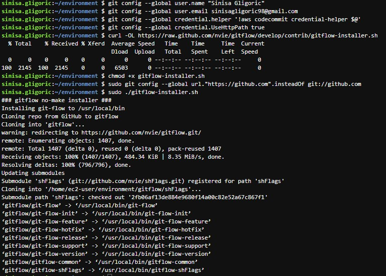

--------------------------------------------

## AWS CloudFormation - Architecture overview

In this module you will use AWS Cloudformation to set up your application and the infrastructure associated with it. You will leverage AWS Elastic Beanstalk to simplify things.

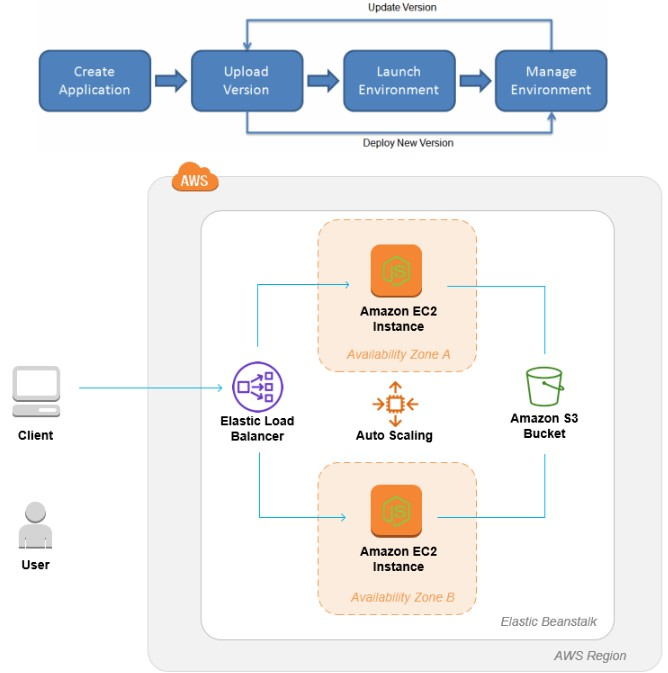

----------------------------------------

## Master branch - Elastic Beanstalk

To simplify the process of setting up and configuring EC2 instances for this tutorial, you will spin up a nodejs environment using AWS Elastic Beanstalk. Elastic Beanstalk lets you easily host web applications without needing to launch, configure, or operate virtual servers on your own. It automatically provisions and operates the infrastructure (e.g. virtual servers, load balancers, etc.) and provides the application stack (e.g. OS, language and framework, web and application server, etc.) for you.

-----------------------------------------

## Elastic Beanstalk Application

### Get a copy of the sample code

In this step, you will retrieve a copy of the sample app’s code and create code commit repo to host the code. The pipeline takes code from the source and then performs actions on it.

### Stage 1: Create Code Commit Repo

`aws codecommit create-repository --repository-name gitflow-workshop --repository-description "Repository for Gitflow Workshop"`

`git clone https://git-codecommit.eu-central-1.amazonaws.com/v1/repos/gitflow-workshop`

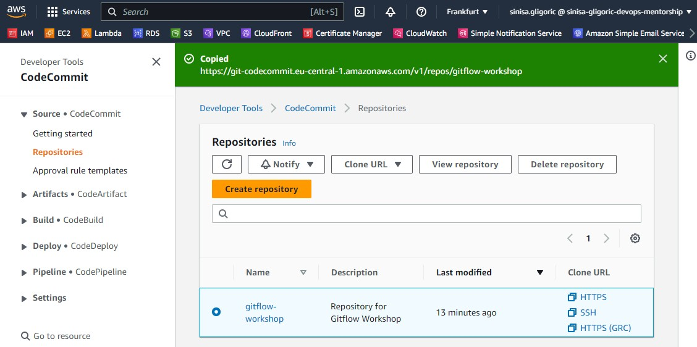

### Stage 2: Download the sample code and commit your code to the repository

1. Download the Sample App archive by running the following command from IDE terminal.

`ASSETURL="https://static.us-east-1.prod.workshops.aws/public/442d5fda-58ca-41f0-9fbe-558b6ff4c71a/assets/workshop-assets.zip"; wget -O gitflow.zip "$ASSETURL"`

2. Unarchive and copy all the contents of the unarchived folder to your local repo folder.

`unzip gitflow.zip -d gitflow-workshop/`

3. Change the directory to your local repo folder. Run git add to stage the change.

`cd gitflow-workshop`
`git add -A`

4. Run git commit to commit the change and push it to master

`git commit -m "Initial Commit"`

`git push origin master`

### Create Elastic Beanstalk Application

To use Elastic Beanstalk we will first create an application, which represents your web application in AWS. In Elastic Beanstalk an application serves as a container for the environments that run your web app, and versions of your web app's source code, saved configurations, logs, and other artifacts that you create while using Elastic Beanstalk.

Run the following AWS CloudFormation template to create:
- Elastic Beanstalk application - think of it as a folder that will hold the components of your Elastic Beanstalk
- S3 bucket for artifacts - place to put your application code before deployment

`aws cloudformation create-stack --template-body file://appcreate.yaml --stack-name gitflow-eb-app`

where appcreate.yaml contains: 

```
AWSTemplateFormatVersion: '2010-09-09'
Parameters: 
  AppName: 
    Type: String
    Description: Name of the beanstalk application.
    Default: gitflow

Resources:
  BeanstalkApplication:
    Type: AWS::ElasticBeanstalk::Application
    Properties:
      Description: AWS Elastic Beanstalk Sample Application
      ApplicationName: 
        Ref: AppName
  ArtifactStoreBucket:
    Type: AWS::S3::Bucket
    Properties:
      VersioningConfiguration:
        Status: Enabled      
Outputs:
  BeanstalkApplication:
    Description: Elastic Beanstalk Application Name
    Value: !Ref BeanstalkApplication
    Export:
      Name: AppName
      
  ArtifactStoreBucket:
    Description: S3 Bucket For Storing Artifacts
    Value: !Ref ArtifactStoreBucket
    Export:
      Name: ArtifactStoreBucket  
```

AWS CloudFormation begins creating the resources that are specified in the template. Your new stack, gitflow-eb-app, appears in the list at the top portion of the Cloudformation console. Its status should be CREATE_IN_PROGRESS. You can see detailed status for a stack by viewing its events.

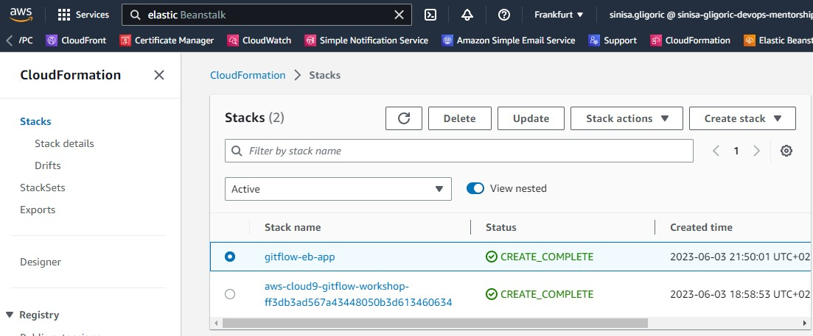

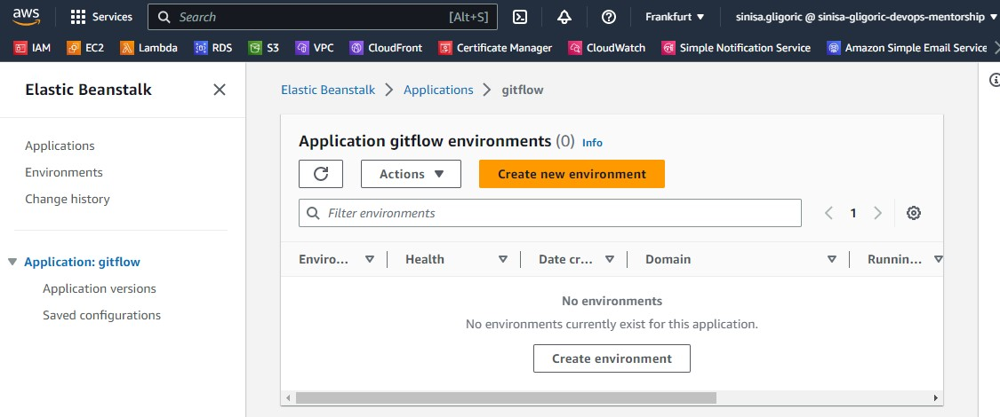

---------------------------------------------------

## Master Environment
### Creating an AWS Elastic Beanstalk Master Environment

You can deploy multiple environments when you need to run multiple versions of an application. For example, you might have development, integration, and production environments.

Use the following AWS CloudFormation templates to set up the elastic beanstalk application and codepipeline to do auto store the artifacts.

`aws cloudformation create-stack --template-body file://envcreate.yaml --parameters file://parameters.json --capabilities CAPABILITY_IAM --stack-name gitflow-eb-master`

where `envcreate.yaml` contains:

```
AWSTemplateFormatVersion: '2010-09-09'
Parameters:
  Environment:
    Type: String
    Description: Name of the beanstalk environment.
  BranchName:
    Description: CodeCommit branch name
    Type: String
  RepositoryName:
    Description: CodeComit repository name
    Type: String

Resources:
  BeanstalkApplicationVersion:
    Type: AWS::ElasticBeanstalk::ApplicationVersion
    Properties:
      ApplicationName:
        Fn::ImportValue: AppName
      Description: AWS ElasticBeanstalk Sample Application Version
      SourceBundle:
        S3Bucket: !Sub "elasticbeanstalk-samples-${AWS::Region}"
        S3Key: nodejs-sample.zip
  BeanstalkConfigurationTemplate:
    Type: AWS::ElasticBeanstalk::ConfigurationTemplate
    Properties:
      ApplicationName:
       Fn::ImportValue: AppName
      Description: AWS ElasticBeanstalk Sample Configuration Template
      OptionSettings:
      - Namespace: aws:autoscaling:asg
        OptionName: MinSize
        Value: '2'
      - Namespace: aws:autoscaling:asg
        OptionName: MaxSize
        Value: '6'
      - Namespace: aws:autoscaling:launchconfiguration
        OptionName: IamInstanceProfile
        Value: 'aws-elasticbeanstalk-ec2-role'
      - Namespace: aws:autoscaling:launchconfiguration
        OptionName: InstanceType
        Value: 't2.micro'
      - Namespace: aws:elasticbeanstalk:environment
        OptionName: EnvironmentType
        Value: LoadBalanced
      SolutionStackName: 64bit Amazon Linux 2 v5.8.2 running Node.js 16
  BeanstalkEnvironment:
    Type: AWS::ElasticBeanstalk::Environment
    Properties:
      ApplicationName:
        Fn::ImportValue: AppName
      Description: AWS ElasticBeanstalk Sample Environment
      TemplateName:
        Ref: BeanstalkConfigurationTemplate
      EnvironmentName:
        Ref: Environment
      VersionLabel:
        Ref: BeanstalkApplicationVersion

  AmazonCloudWatchEventRole:
    Type: 'AWS::IAM::Role'
    Properties:
      AssumeRolePolicyDocument:
        Version: 2012-10-17
        Statement:
          - Effect: Allow
            Principal:
              Service:
                - events.amazonaws.com
            Action: 'sts:AssumeRole'
      Path: /
      Policies:
        - PolicyName: cwe-pipeline-execution
          PolicyDocument:
            Version: 2012-10-17
            Statement:
              - Effect: Allow
                Action: 'codepipeline:StartPipelineExecution'
                Resource: !Join
                  - ''
                  - - 'arn:aws:codepipeline:'
                    - !Ref 'AWS::Region'
                    - ':'
                    - !Ref 'AWS::AccountId'
                    - ':'
                    - !Ref AppPipeline
  AmazonCloudWatchEventRule:
    Type: 'AWS::Events::Rule'
    Properties:
      EventPattern:
        source:
          - aws.codecommit
        detail-type:
          - CodeCommit Repository State Change
        resources:
          - !Join
            - ''
            - - 'arn:aws:codecommit:'
              - !Ref 'AWS::Region'
              - ':'
              - !Ref 'AWS::AccountId'
              - ':'
              - !Ref RepositoryName
        detail:
          event:
            - referenceCreated
            - referenceUpdated
          referenceType:
            - branch
          referenceName:
            - master
      Targets:
        - Arn: !Join
            - ''
            - - 'arn:aws:codepipeline:'
              - !Ref 'AWS::Region'
              - ':'
              - !Ref 'AWS::AccountId'
              - ':'
              - !Ref AppPipeline
          RoleArn: !GetAtt
            - AmazonCloudWatchEventRole
            - Arn
          Id: codepipeline-AppPipeline
  AppBuild:
    Type: AWS::CodeBuild::Project
    Properties:
      Name: !Join
          - ''
          - - !Ref Environment
            - '-build'
      Description: Run Unit Test
      ServiceRole: !GetAtt CodeBuildRole.Arn
      Artifacts:
        Type: CODEPIPELINE
      Environment:
        Type: LINUX_CONTAINER
        ComputeType: BUILD_GENERAL1_SMALL
        Image: aws/codebuild/standard:5.0
      Source:
        Type: CODEPIPELINE
      TimeoutInMinutes: 10
  CodeBuildRole:
    Type: AWS::IAM::Role
    Properties:
      AssumeRolePolicyDocument:
        Statement:
        - Action: ['sts:AssumeRole']
          Effect: Allow
          Principal:
            Service: [codebuild.amazonaws.com]
        Version: '2012-10-17'
      Path: /
      Policies:
        - PolicyName: CodeBuildAccess
          PolicyDocument:
            Version: '2012-10-17'
            Statement:
              - Action:
                - 'logs:*'
                - 's3:*'
                Effect: Allow
                Resource: '*'
  AppPipeline:
    Type: 'AWS::CodePipeline::Pipeline'
    DependsOn: BeanstalkEnvironment
    Properties:
      Name: !Join
            - ''
            - - !Ref Environment
              - '-pipeline'
      RoleArn: !GetAtt
        - CodePipelineServiceRole
        - Arn
      Stages:
        - Name: Source
          Actions:
            - Name: SourceAction
              ActionTypeId:
                Category: Source
                Owner: AWS
                Version: 1
                Provider: CodeCommit
              OutputArtifacts:
                - Name: SourceArtifact
              Configuration:
                BranchName: !Ref BranchName
                RepositoryName: !Ref RepositoryName
                PollForSourceChanges: false
              RunOrder: 1
        - Name: Build
          Actions:
            - Name: UnitTest
              InputArtifacts:
                - Name: SourceArtifact
              ActionTypeId:
                Category: Test
                Owner: AWS
                Version: 1
                Provider: CodeBuild
              Configuration:
                ProjectName: !Ref AppBuild
              RunOrder: 1
        - Name: Deploy
          Actions:
            - Name: Deployment
              InputArtifacts:
                - Name: SourceArtifact
              ActionTypeId:
                Category: Deploy
                Owner: AWS
                Version: 1
                Provider: ElasticBeanstalk
              Configuration:
                ApplicationName:
                  Fn::ImportValue: AppName
                EnvironmentName: !Ref Environment
              RunOrder: 1
      ArtifactStore:
        Type: S3
        Location:
            Fn::ImportValue: ArtifactStoreBucket
  CodePipelineServiceRole:
    Type: 'AWS::IAM::Role'
    Properties:
      AssumeRolePolicyDocument:
        Version: 2012-10-17
        Statement:
          - Effect: Allow
            Principal:
              Service:
                - codepipeline.amazonaws.com
            Action: 'sts:AssumeRole'
      Path: /
      Policies:
        - PolicyName: AWS-CodePipeline-Service-3
          PolicyDocument:
            Version: 2012-10-17
            Statement:
              - Effect: Allow
                Action:
                  - 'codecommit:CancelUploadArchive'
                  - 'codecommit:GetBranch'
                  - 'codecommit:GetCommit'
                  - 'codecommit:GetUploadArchiveStatus'
                  - 'codecommit:UploadArchive'
                Resource: '*'
              - Effect: Allow
                Action:
                  - 'codedeploy:CreateDeployment'
                  - 'codedeploy:GetApplicationRevision'
                  - 'codedeploy:GetDeployment'
                  - 'codedeploy:GetDeploymentConfig'
                  - 'codedeploy:RegisterApplicationRevision'
                Resource: '*'
              - Effect: Allow
                Action:
                  - 'codebuild:BatchGetBuilds'
                  - 'codebuild:StartBuild'
                Resource: '*'
              - Effect: Allow
                Action:
                  - 'lambda:InvokeFunction'
                  - 'lambda:ListFunctions'
                Resource: '*'
              - Effect: Allow
                Action:
                  - 'iam:PassRole'
                Resource: '*'
              - Effect: Allow
                Action:
                  - 'elasticbeanstalk:*'
                  - 'ec2:*'
                  - 'elasticloadbalancing:*'
                  - 'autoscaling:*'
                  - 'cloudwatch:*'
                  - 's3:*'
                  - 'sns:*'
                  - 'cloudformation:*'
                Resource: '*'

```

and `parameters.json` contains:

```
[
  {
    "ParameterKey": "Environment",
    "ParameterValue": "gitflow-workshop-master"
  },
  {
    "ParameterKey": "RepositoryName",
    "ParameterValue": "gitflow-workshop"
  },
  {
    "ParameterKey": "BranchName",
    "ParameterValue": "master"
  }
]

```

We have error with ElasticBeanstalk EC2 role: `The instance profile aws-elasticbeanstalk-ec2-role associated with the environment does not exist.`
It was necessary to create a special role for the EC2 instance and assign permissions for EB, because the creation of this role is not done automatically as it used to be, but it is necessary to do that part manually.

We should create IAM EC2 role named `aws-elasticbeanstalk-ec2-role` and assign permissions `AWSElasticBeanstalkWebTier`, `AWSElasticBeanstalkWorkerTier` and `AWSElasticBeanstalkMulticontainerDocker`. 

Now after running the same command, everything works fine. 

Your stack might take several minutes to create—but you probably don't want to just sit around waiting. If you're like us, you'll want to know how the stack creation is going. Your new stack, gitflow-eb-master, appears in the list at the top portion of the Cloudformation console . Its status should be CREATE_IN_PROGRESS. You can see detailed status for a stack by viewing its events. The CREATE_COMPLETE event is logged when the resource is successfully created.

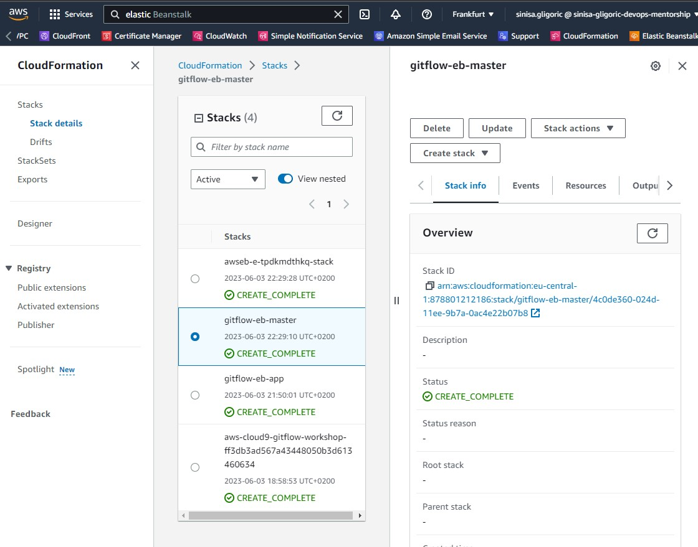

Once the cloudformation successfully created the stack go to AWS Elastic Beanstalk Environment Management Console . Once the environment health turns green, click on the URL next to the environment name to view view the sample nodejs application you deployed.

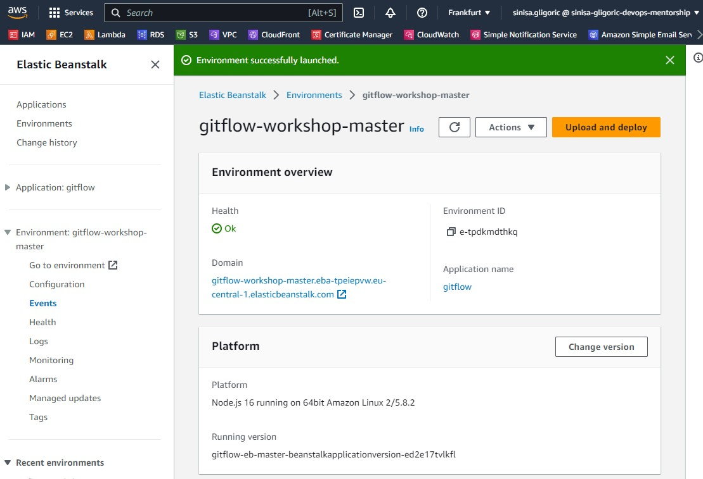

### AWS CodePipeline

AWS CodePipeline is a continuous delivery service you can use to model, visualize, and automate the steps required to release your software. You can quickly model and configure the different stages of a software release process. CodePipeline automates the steps required to release your software changes continuously.

Above cloudformation template will also create and configure a simple AWS CodePipeline with three actions: source, build and deploy.

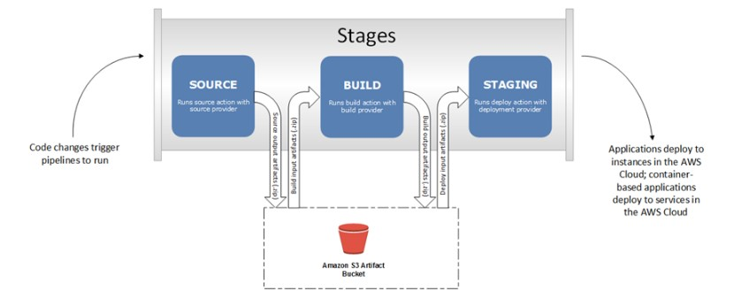

After your pipeline is created, the pipeline status page appears and the pipeline automatically starts to run. You can view progress as well as success and failure messages as the pipeline performs each action.

To verify your pipeline ran successfully, monitor the progress of the pipeline as it moves through each stage by going to CodePipeline Console . The status of each stage will change from No executions yet to In Progress, and then to either Succeeded or Failed. The pipeline should complete the first run within a few minutes.

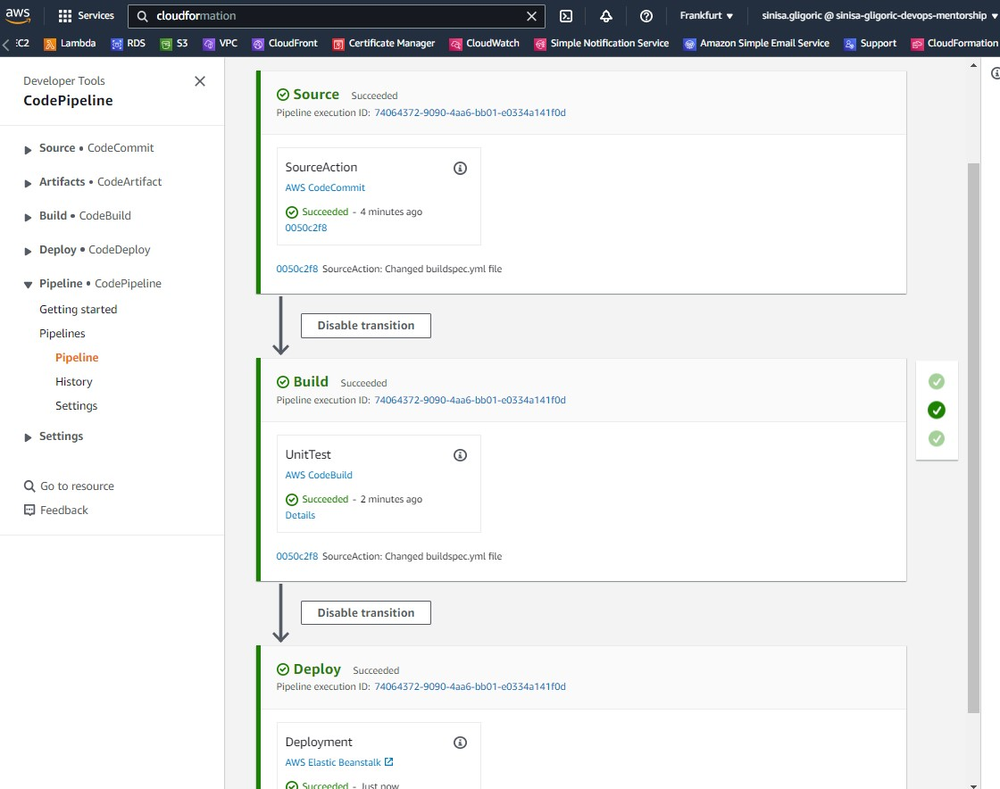

---------------------------------------------

## Lambda

AWS Lambda is a compute service that lets you run code without provisioning or managing servers. AWS Lambda executes your code only when needed and scales automatically, from a few requests per day to thousands per second. You pay only for the compute time you consume - there is no charge when your code is not running. With AWS Lambda, you can run code for virtually any type of application or backend service - all with zero administration.

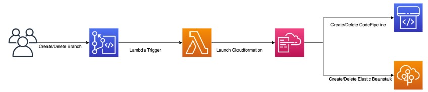

### Create Lambda

You can configure a CodeCommit repository so that code pushes or other events trigger actions, such as invoking a function in AWS Lambda. The following steps include creating a Lambda function which will be used with a CodeCommit trigger.

`aws cloudformation create-stack --template-body file://lambda/lambda-create.yaml --stack-name gitflow-workshop-lambda --capabilities CAPABILITY_IAM`

where `lambda-create.yaml` contains:

```
AWSTemplateFormatVersion: '2010-09-09'
Resources:
  LambdaRole:
    Type: 'AWS::IAM::Role'
    Properties:
      AssumeRolePolicyDocument:
        Version: 2012-10-17
        Statement:
          - Effect: Allow
            Principal:
              Service:
                - lambda.amazonaws.com
            Action: 'sts:AssumeRole'
      Path: /
      ManagedPolicyArns:
        - arn:aws:iam::aws:policy/IAMFullAccess
        - arn:aws:iam::aws:policy/AdministratorAccess-AWSElasticBeanstalk
        - arn:aws:iam::aws:policy/AWSCodeCommitReadOnly
        - arn:aws:iam::aws:policy/AWSCodePipeline_FullAccess
        - arn:aws:iam::aws:policy/CloudWatchEventsFullAccess
        - arn:aws:iam::aws:policy/AWSCloudFormationFullAccess
  PipelineCreateLambdaFunction:
    Type: 'AWS::Lambda::Function'
    Properties:
      FunctionName: 'gitflow-workshop-create-pipeline'
      Description: 'Lambda Function to create pipelines on branch creation'
      Code:
        S3Bucket: 'elasticbeanstalk-eu-central-1-878801212186'
        S3Key: 'aws-s3-eb-key.zip'
      Handler: 'pipeline-create.lambda_handler'
      Runtime: 'python3.8'
      Role:
        Fn::GetAtt:
          - LambdaRole
          - Arn
  PipelineCreateLambdaPermission:
    Type: 'AWS::Lambda::Permission'
    DependsOn: PipelineCreateLambdaFunction
    Properties:
      Action: 'lambda:InvokeFunction'
      Principal: "codecommit.amazonaws.com"
      FunctionName: 'gitflow-workshop-create-pipeline'
  PipelineDeleteLambdaFunction:
    Type: 'AWS::Lambda::Function'
    Properties:
      FunctionName: 'gitflow-workshop-delete-pipeline'
      Description: 'Lambda Function to delete pipelines on branch deletion'
      Code:
        S3Bucket: 'elasticbeanstalk-eu-central-1-878801212186'
        S3Key: 'aws-s3-eb-key.zip'
      Handler: 'pipeline-delete.lambda_handler'
      Runtime: 'python3.8'
      Role:
        Fn::GetAtt:
          - LambdaRole
          - Arn
  PipelineDeleteLambdaPermission:
    Type: 'AWS::Lambda::Permission'
    DependsOn: PipelineDeleteLambdaFunction
    Properties:
      Action: 'lambda:InvokeFunction'
      Principal: "codecommit.amazonaws.com"
      FunctionName: 'gitflow-workshop-delete-pipeline'
```

 Ensure that you change `S3Bucket` ARN and `S3Key` ARN so that it suit your environment. You can edit S3 bucket properties and grab a default`aws/s3` key ARN which you have to save into txt file and zip so that you can include that into lambda-create.yaml file listed above.

--------------------------------------------

## AWS CodeCommit Trigger

You can configure a CodeCommit repository so that code pushes or other events trigger actions, such as sending a notification from Amazon Simple Notification Service (Amazon SNS) or invoking a function in AWS Lambda. You can create up to 10 triggers for each CodeCommit repository.

Triggers are commonly configured to:

- Send emails to subscribed users every time someone pushes to the repository.

- Notify an external build system to start a build after someone pushes to the main branch of the repository

### Create a Trigger in AWS CodeCommit for an Existing AWS Lambda Function

In this step you will create a trigger in CodeCommit which invokes a Lambda function when a branch or tag is created.

1. Open the CodeCommit  console

2. In Repositories, choose the gitflow-workshop repository where you want to create triggers for repository events.

3. In the navigation pane for the gitflow-workshop repository, choose Settings, and then choose Triggers.

4. Choose Create trigger. In Create trigger, do the following:

- In Trigger name, enter a name for the trigger (for example, CreateBranch).
- In Events, choose the repository events that trigger the Lambda function: Create branch or tag.
- In Branches, leave the selection blank, because this default option applies the trigger to all branches automatically.
- In Choose the service to use, choose AWS Lambda. In Lambda function, choose the function name from the list, or enter the ARN for the function.

5. Choose Create trigger. In Create trigger, do the following:

- In Trigger name, enter a name for the trigger (for example, DeleteBranch).
- In Events, choose the repository events that trigger the Lambda function: Delete branch or tag.
- In Branches, leave the selection blank, because this default option applies the trigger to all branches automatically.
- In Choose the service to use, choose AWS Lambda. In Lambda function, choose the function name from the list, or enter the ARN for the function.

After you finish those steps , you should see something similar to below:

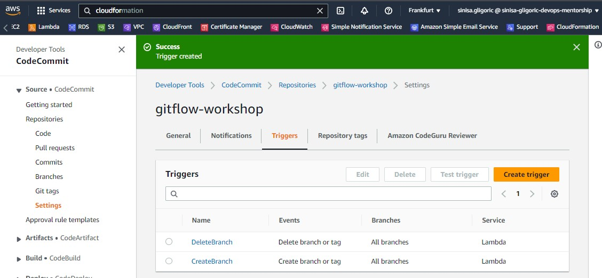

--------------------------------------------

## Develop branch
### Create Develop Branch

When using the git-flow extension library, executing `git flow init` on an existing repo will create the develop branch.

List the current branches `git branch`. The current branch will be highlighted in green and marked with an asterisk.

Push commits made on a local branch to a remote repository `git push -u origin develop`.

---------------------------------------------

## Create Development Environment

After pushing the commits to development branch, the lambda function you created earlier will automatically detect a new develop branch created and codecommit will trigger the function to create the development environment and code pipeline.

Your new stack, gitflow-workshop-develop, appears in the list at the top portion of the Cloudformation console . Once the cloudformation successfully created the stack go to AWS Elastic Beanstalk Environment Management Console.

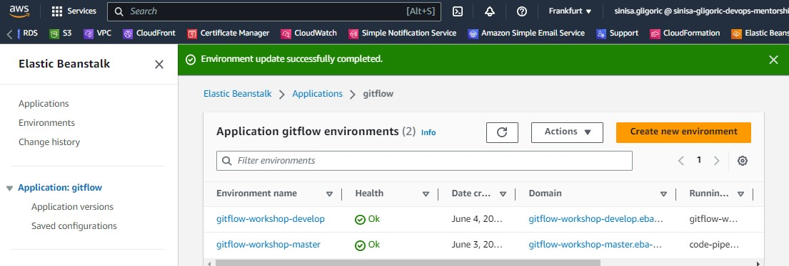

Go to the environment URL for the gitflow-workshop-develop application and the web browser should display the sample nodejs application that you just deployed.

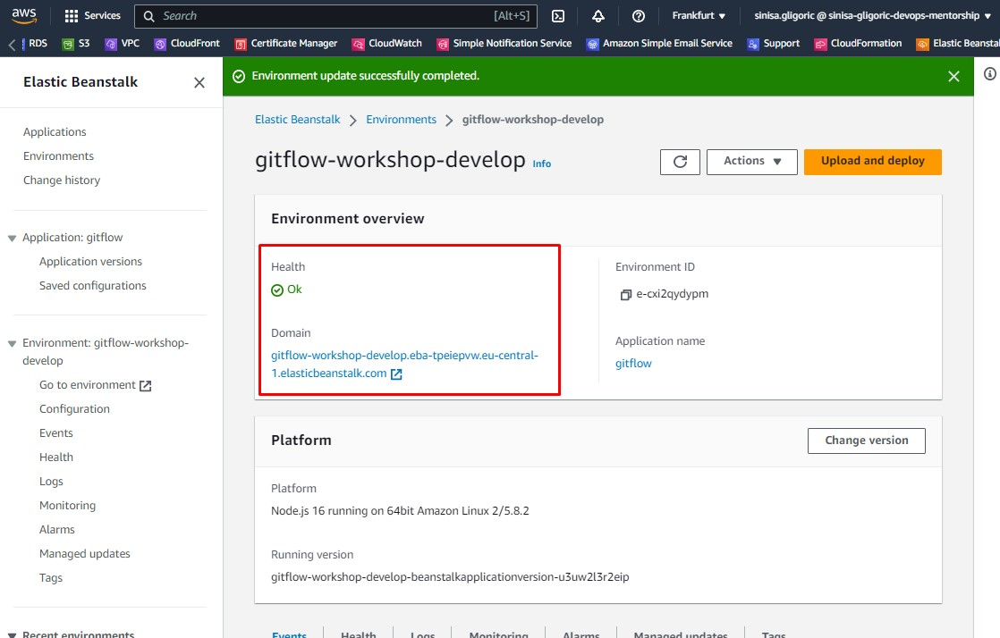

Cloudformation template also creates a new code pipeline gitflow-workshop-develop-pipeline for the development branch. This also uses event-based Amazon CloudWatch Events rules as the change detection method for your pipelines with a CodeCommit repository. When Amazon CloudWatch Events rule detects source changes it starts the pipeline.

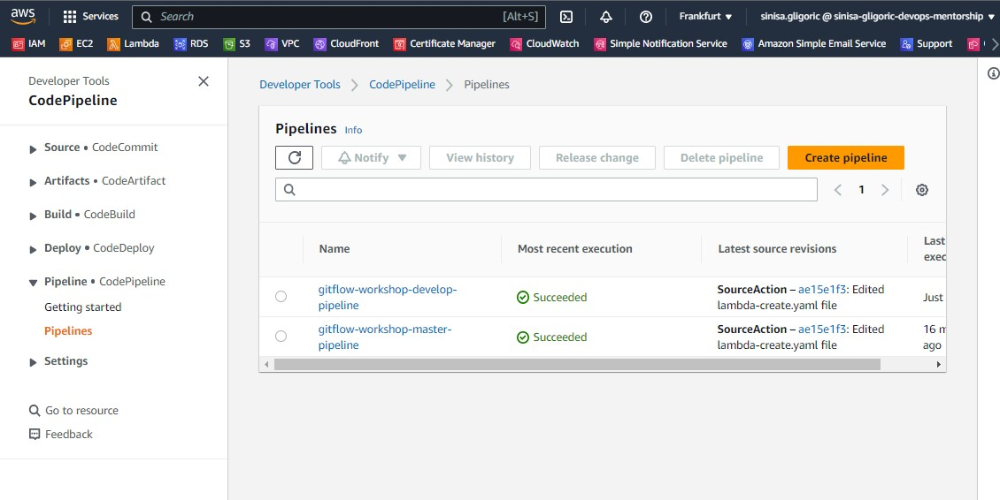

-------------------------------------------

## Feature Branches

Each new feature should reside in its own branch, which can be pushed to the central repository for backup/collaboration. But, instead of branching off of master, feature branches use develop as their parent branch. When a feature is complete, it gets merged back into develop. Features should never interact directly with master.

The idea is to create a pipeline per branch. Each pipeline has a lifecycle that is tied to the branch. When a new, short-lived branch is created, we create the pipeline and required resources. After the short-lived branch is merged into develop, we clean up the pipeline and resources to avoid recurring costs.

### Create Feature Branch

The name of the feature is up to you, choose something simple and short, describing what you are doing. For this workshop we are going to change color by simply editing index.html file. To start a feature named change-color you’ll use:

`git flow feature start change-color`

`git push -u origin feature/change-color`

This will automatically do the following:

- create a new branch named feature/change-color from the develop branch,
- checkout the feature/change-color branch So, yes, you’re ready to go! Just hack, commit, push, . . . You’ This action performs the following:

And you should see something similar to:

```
Switched to a new branch 'feature/change-color'               

.....
.....   
```

### Create feature branch environment

The lambda function you created earlier will automatically detect a new branch it will trigger the function to create the environment and code pipeline.

### Commit a change and then update your app

In this step, you will revise the sample code and commit the change to your repository. CodePipeline will detect your updated sample code and then automatically initiate AWS CodeBuild to build the source code. CodePipeline then uses Elastic Beanstalk to deploy the build output to the environment.

`Edit line:38 in index.html. We are going to change the color from purple to green`

1. The git status command displays the state of the working directory and the staging area.

`git status`

2. Run git add to stage the change.

`git add -A`

3. Run git commit to commit the change and push it to feature/change-color branch

```
git commit -m "Changed Color"    
git push --set-upstream origin feature/change-color
```
Amazon CloudWatch Events rule detects source changes it starts the pipeline. To verify your pipeline ran successfully, monitor the progress of the pipeline gitflow-workshop-feature-change-color-pipeline as it moves through each stage by going to CodePipeline Console.

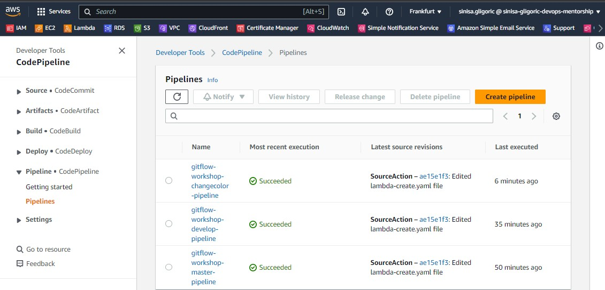

After the pipeline ran successfully, go to the environment URL for the gitflow-workshop-changecolor application and the web browser should display the latest changes you made. 

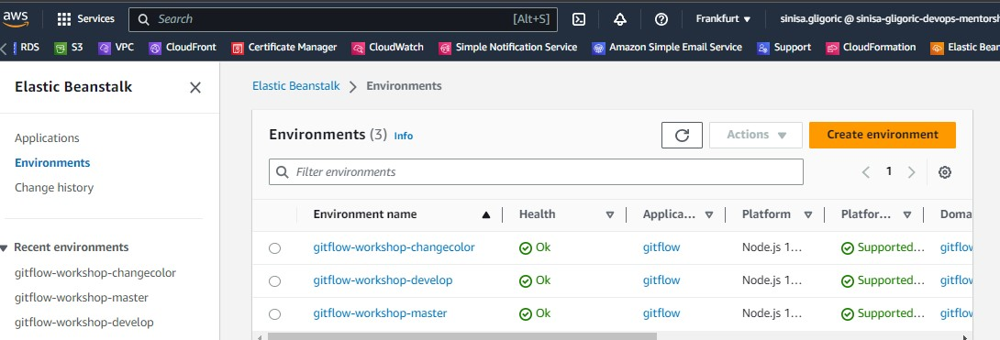

### Only run the below step if the lambda trigger is not working

You can manually trigger the creation of the development environment

`aws cloudformation create-stack --template-body file://envcreate.yaml --capabilities CAPABILITY_IAM --stack-name gitflow-workshop-changecolor --parameters ParameterKey=Environment,ParameterValue=gitflow-workshop-changecolor ParameterKey=RepositoryName,ParameterValue=gitflow-workshop ParameterKey=BranchName,ParameterValue=feature/change-color`

-------------------------------------------

## Feature Finish

### Step 1: Finish feature development

Once you have verified the changes you made and is ready to merge to develop branch.Finish the development of a feature by executing `git flow feature finish change-color`.

This action performs the following:

- Merges change-color into develop

- Removes the feature branch

- Switches back to develop branch

### Step 2: Delete the feature branch change-color and push it to remote at the same time `git push origin --delete feature/change-color`.

This step will trigger the DeleteBranch lambda function you created earlier and will delete the gitflow-workshop-feature-change-color Elastic Beanstalk environment and gitflow-workshop-feature-change-color-pipeline Code Pipeline.

### Step 3: Push the develop branch changes to codecommit `git push --set-upstream origin develop`.

Amazon CloudWatch Events rule detects changes in the develop branch it starts the pipeline. To verify your pipeline ran successfully, monitor the progress of the pipeline gitflow-workshop-develop-pipeline as it moves through each stage by going to CodePipeline Console . After the pipeline ran successfully, go to the environment URL for the gitflow-workshop-develop application to see the latest changes.

------------------------------------------

## Cleanup

### Delete Develop & Master Environments

```
aws cloudformation delete-stack --stack-name gitflow-eb-master

aws cloudformation delete-stack --stack-name gitflow-workshop-develop
```
### Delete Feature Environment

`aws cloudformation delete-stack --stack-name gitflow-workshop-feature-change-color`

### Delete Lambda Functions

`aws cloudformation delete-stack --stack-name gitflow-workshop-lambda`

### Delete Elastic Beanstalk Application

`aws cloudformation delete-stack --stack-name gitflow-eb-app`

### Empty the S3 bucket used to store the artifacts before deleting the elasticbeanstalk application.

### Delete code commit repository

`aws codecommit delete-repository --repository-name gitflow-workshop`

### Delete AWS Cloud9

- In the AWS Cloud9  console, highlight your Cloud9 workspace
- Select Delete

-----------------------------------------
### END

