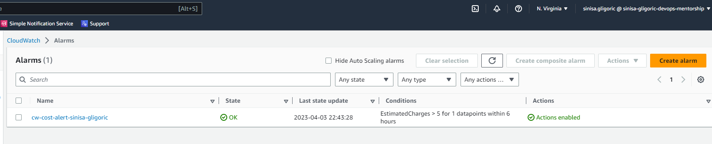
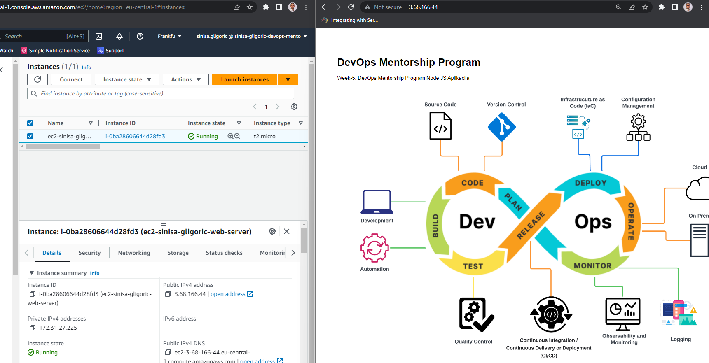
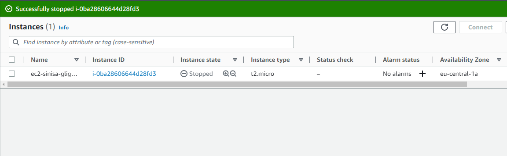

# week-7-ec2-iam-nginx-nodejs-deployment
## Notes below are captured during creating EC2 instance, adding customer managed IAM Policies, creating CloudWatch billing alert, creating SNS topic, subscribing to that topic and deploying NGINX as reverse proxy for serving simple NodeJS application.
----------------------------------------------------------------------------------

# table-of-contents
## 1. [IAM Policies](#iam-policies)
## 2. [CloudWatch and SNS](#cloudwatch-and-sns)
## 3. [EC2, NGINX and NodeJS](#ec2-nginx-and-nodejs)

--------------------------------------------------------------------------------

## IAM Policies
### In previous weeks, I created Tier2 IAM Group and added specific user from Tier2 group. Now I have to add customer managed IAM Policies in order to allow that user specific permissions on AWS.

`tier2.create-ec2-instance-us1.json` - This IAM Policy allows all actions under EC2, ClodWatch and SNS in us-east-1 region and also requires MFA to be successfully enabled and verified. Also, this policy denies every action under EC2 service for EC2 instance types different than t2.micro, because t2.micro instance types are eligible for AWS Free Tier. 

```
{
    "Version": "2012-10-17",
    "Statement": [
        {
            "Sid": "AllowAllActionsInUsEast1ForT2Micro",
            "Effect": "Allow",
            "Action": [
                "ec2:*",
                "cloudwatch:*",
                "sns:*"
            ],
            "Resource": "*",
            "Condition": {
                "StringEquals": {
                    "aws:RequestedRegion": "us-east-1"
                },
                "Bool": {
                    "aws:MultiFactorAuthPresent": "true"
                }
            }
        },
        {
            "Effect": "Deny",
            "Action": "ec2:*",
            "Resource": "*",
            "Condition": {
                "ForAnyValue:StringNotLike": {
                    "ec2:InstanceType": [
                        "t2.micro"
                    ]
                }
            }
        }
    ]
}
```

`tier2.selfmanage-iam-user.policy.json` - This policy allows user from Tier2 IAM Group to view it's user information, manage own passwords/certificates/ssh keys/git credentials/virtual MFA devices. 

```
{
    "Version": "2012-10-17",
    "Statement": [
        {
            "Sid": "ViewOwnUserInfo",
            "Effect": "Allow",
            "Action": [
                "iam:GetAccountPasswordPolicy",
                "iam:ListVirtualMFADevices",
                "iam:GetAccountSummary",
                "iam:ListAccountAliases",
                "iam:GetLoginProfile",
                "iam:GetUserPolicy",
                "iam:ListGroupsForUser",
                "iam:ListAttachedUserPolicies",
                "iam:ListUserPolicies",
                "iam:GetGroupPolicy",
                "iam:GetPolicyVersion",
                "iam:GetPolicy",
                "iam:ListAttachedGroupPolicies",
                "iam:ListGroupPolicies",
                "iam:ListPolicyVersions",
                "iam:ListPolicies",
                "iam:ListUsers"
            ],
            "Resource": "*"
        },
        {
            "Sid": "AllowManageOwnPasswords",
            "Effect": "Allow",
            "Action": [
                "iam:ChangePassword",
                "iam:GetUser"
            ],
            "Resource": "arn:aws:iam::*:user/${aws:username}"
        },
        {
            "Sid": "AllowManageOwnAccessKeys",
            "Effect": "Allow",
            "Action": [
                "iam:CreateAccessKey",
                "iam:DeleteAccessKey",
                "iam:ListAccessKeys",
                "iam:UpdateAccessKey"
            ],
            "Resource": "arn:aws:iam::*:user/${aws:username}"
        },
        {
            "Sid": "AllowManageOwnSigningCertificates",
            "Effect": "Allow",
            "Action": [
                "iam:DeleteSigningCertificate",
                "iam:ListSigningCertificates",
                "iam:UpdateSigningCertificate",
                "iam:UploadSigningCertificate"
            ],
            "Resource": "arn:aws:iam::*:user/${aws:username}"
        },
        {
            "Sid": "AllowManageOwnSSHPublicKeys",
            "Effect": "Allow",
            "Action": [
                "iam:DeleteSSHPublicKey",
                "iam:GetSSHPublicKey",
                "iam:ListSSHPublicKeys",
                "iam:UpdateSSHPublicKey",
                "iam:UploadSSHPublicKey"
            ],
            "Resource": "arn:aws:iam::*:user/${aws:username}"
        },
        {
            "Sid": "AllowManageOwnGitCredentials",
            "Effect": "Allow",
            "Action": [
                "iam:CreateServiceSpecificCredential",
                "iam:DeleteServiceSpecificCredential",
                "iam:ListServiceSpecificCredentials",
                "iam:ResetServiceSpecificCredential",
                "iam:UpdateServiceSpecificCredential"
            ],
            "Resource": "arn:aws:iam::*:user/${aws:username}"
        },
        {
            "Sid": "AllowManageOwnVirtualMFADevice",
            "Effect": "Allow",
            "Action": [
                "iam:CreateVirtualMFADevice"
            ],
            "Resource": "arn:aws:iam::*:mfa/*"
        },
        {
            "Sid": "AllowManageOwnUserMFA",
            "Effect": "Allow",
            "Action": [
                "iam:DeactivateMFADevice",
                "iam:EnableMFADevice",
                "iam:ListMFADevices",
                "iam:ResyncMFADevice"
            ],
            "Resource": "arn:aws:iam::*:user/${aws:username}"
        }
    ]
}
```

-------------------------------------

## CloudWatch and SNS
### In order to create CloudWatch billing alert to send email if estimated AWS costs reach 5$, I created SNS topic, subscribed to that topic and created CloudWatch billing alert.



-------------------------------------

## EC2, NGINX and NodeJS
### I created t2.micro EC2 instance under eu-central-1 region (Frankfurt) from Amazon Linux 3 AMI Image. I have added security group and allowed SSH and HTTP inbound traffic. Created SSH pair of keys in order to securely connect via SSH. Created and attached EBS volume size 14GiB gp3. Then, in order to set NGINX as reverse proxy and deploy NodeJS simple application as backend server, I had to make several configurations which are described below:


`$ ssh -i "key.pem" ec2-user@ec2-public-ip` - connect to EC2 instance via SSH public-private key pair

`$ sudo yum update && sudo yum upgrade` - update repository packages and upgrade all installed packages with a newer versions

`$ sudo yum install nginx -y` - install nginx

`$ sudo systemctl enable nginx && sudo systemctl start nginx` - enable nginx service in order to start whenever system boots and start nginx.service

`$ sudo systemctl status nginx` - verify that nginx.service is running

`$ sudo yum install git` - install git in order to clone NodeJS App

`$ mkdir ~/nodejs-simple-app && cd ~/nodejs-simple-app` - make directory and position inside that directory

`$ ssh-keygen -t ed25519 -C "from ec2-sinisa-gligoric-web-server to github"
` - generate SSH key pair and paste public key to Github in order to authenticate

`$ git clone git@github.com:allops-solutions/nodejs-simple-app.git
` - clone NodeJS application

`$ sudo yum install nodejs` - install NodeJS

`$ sudo yum install npm` - install Node Package Manager

`$ sudo npm install -g pm2` - install Node Process Manager

`$ pm2 start server.js` - start NodeJS server

`$ pm2 list` - list active NodeJS server processes

`$ pm2 startup` - generate startup script in order to start NodeJS server when system boots up

`$ pm2 save` - save currently process list

`$ sudo nano /etc/nginx/conf.d/node-app.conf` - create node-app.conf and open in nano editor and add configuration below:
```
server {
  listen 80;
  server_name public_ip_address;

  location / {
    proxy_pass http://127.0.0.1:8008;
    proxy_http_version 1.1;
    proxy_set_header Upgrade $http_upgrade;
    proxy_set_header Connection 'upgrade';
    proxy_set_header Host $host;
    proxy_cache_bypass $http_upgrade;
  }
}
```

`$ sudo nginx -t` - test NGINX configuration in order to eliminate syntax errors

`$ sudo nginx -s reload` - gracefully reload NGINX configuration without restarting NGINX service

I opened the browser and ensured that application is accessible on http://public_ip_address/ which in my case looks like on screenshot below:



### After solving this task, I stopped EC2 instance because we don't want additional and unnecessary costs, even though we are still in Free Tier.



---------------------------------------

## END