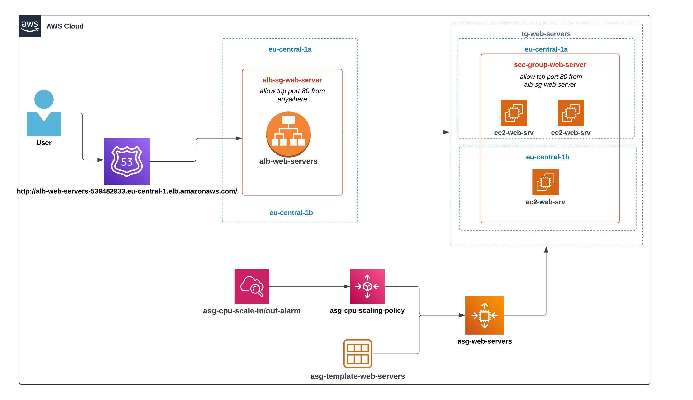

# week-8-autoscaling-group-and-load-balancer
### Notes below are captured during solving TASK-7: Autoscaling Group and Load Balancer
----------------------------------------------------------------------------------
1. Inside IAM, I have added IAM User 2 to Administrators group. 

2. Created AMI image `ami-sinisa-gligoric-web-server` from EC2 instance `ec2-sinisa-gligoric-web-server`. Launched instance `ec2-sinisa-gligoric-web-server-2` from AMI image `ami-sinisa-gligoric-web-server` and ensured that both instances are working properly. Accessed NGINX-NodeJS app through browser via public IPs of both EC2 instances and verified that app is accessible.

3. Created Target Group `tg-web-servers` with target type: Instances. Target group listens on HTTP port and also health checks from ALB to TG are done via port 80. Registered/Added two targets (EC2 instances) to target group. 

4. Created Application Load Balancer `alb-web-servers` and mapped two AZs `eu-central-1a` and `eu-central-1b`, to increase fault tolerance of application. Added Listener HTTP:80 and configured default action to forward all incoming requests to target group `tg-web-servers`. Also created new security group `alb-sg-web-server` and added inbound rule to allow HTTP traffic from anywhere. After that, edited inbound rule of security group `sec-group-web-servers` to allow HTTP only from `alb-sg-web-server` instead from `anywhere`. 

5. Created Launch Template `asg-template-web-servers` with custom AMI image `ami-sinisa-gligoric-web-server`, instance-type: `t2.micro`, security group: `sec-group-web-server`, existing key pair: `sinisa-gligoric-web-server-key` and root EBS volume: `14GiB gp3`.

6. Created Auto Scaling Group `asg-web-servers` from Launch Template `asg-template-web-servers`. Defined multiple availability zones (`eu-central-1a` and `eu-central-1b`) that Auto Scaling group can use for scaling up and down (launching and terminating instances). Attached Target Group `tg-web-servers`. Enabled Elastic Load Balancing health checks. Enabled group metrics collection within CloudWatch. Configured Desired capacity: 3, Minimum capacity: 2 and Maximum capacity: 4 instances. Enabled Target tracking scaling policy `asg-cpu-scaling-policy` with Metric type: Average CPU utilization and Target value: 18 (means 18% percent). Configured notifications to SNS topic `asg-sns-topic-web-servers` with all event types for ASG group (Launch, Terminate, Fail to launch, Fail to terminate).

7. Tested Auto Scaling Group `asg-web-servers` with stress CPU utility which I installed on ASG EC2 instances. After launching stress utility, CPU goes up and scaling policy `asg-cpu-scaling-policy`, based on CloudWatch alarm, launched new EC2 instances inside `asg-web-servers` group achieving maximum capacity of 4 EC2 instances. After terminating stress CPU utility, scaling policy `asg-cpu-scaling-policy` terminates those new EC2 instances and maintains minimum capacity of 2 EC2 instances. 

8. Simulated fault tolerance and high availability of application by terminating EC2 instances inside `tg-web-servers` and by stopping nginx service on them. As soon as Load Balancer health checks figured out unhealthy instances, `asg-web-servers` Auto Scaling Group launched new EC2 instance in response to an unhealthy instance needing to be replaced.

9. Created Auto Scaling Group and Load Balancer infrastructure diagram. 

10. Application accessible via ALB DNS record: http://alb-web-servers-539482933.eu-central-1.elb.amazonaws.com/ 

-------------------------------------------------------------------------------

### END

