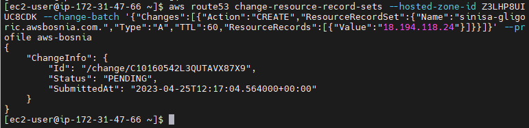
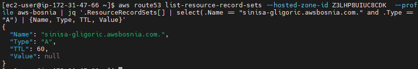
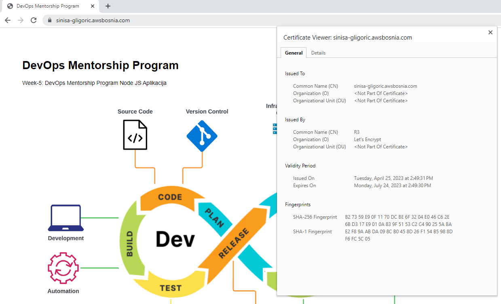
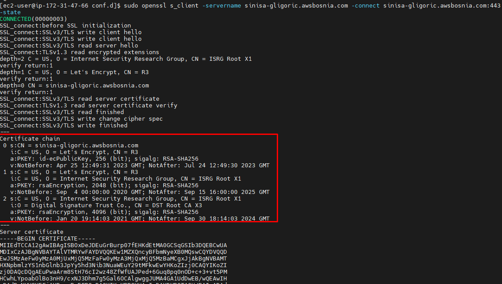
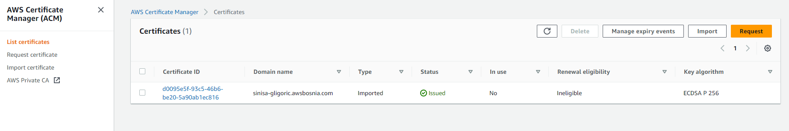
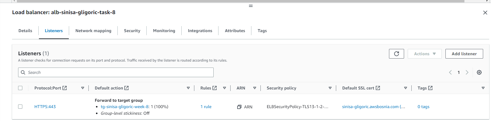
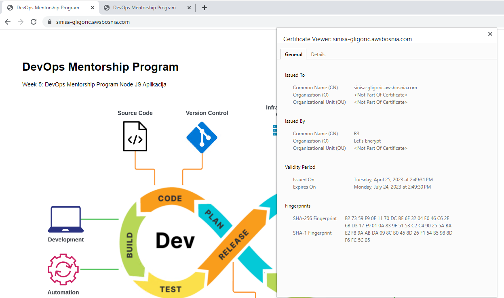
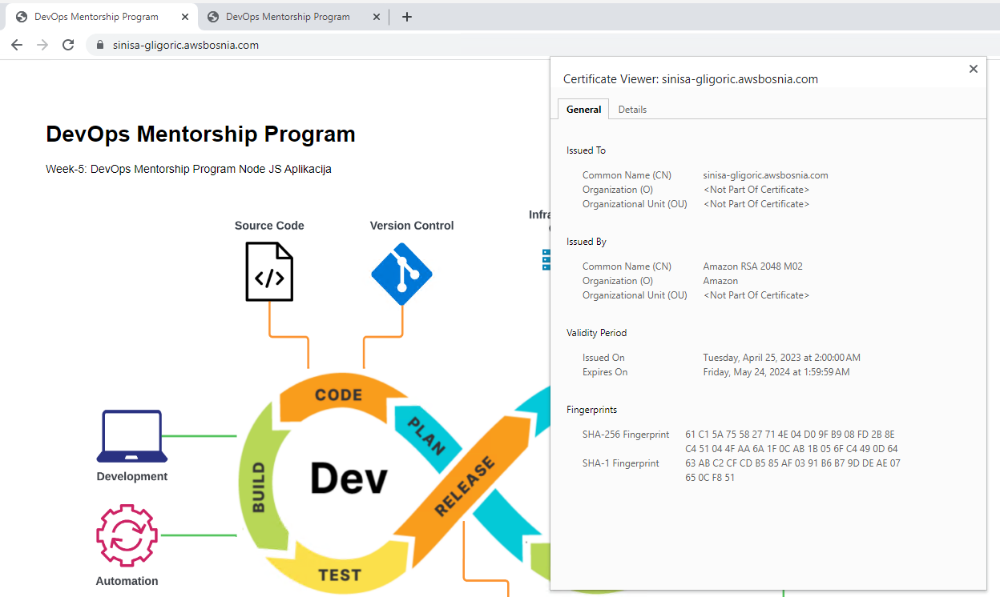
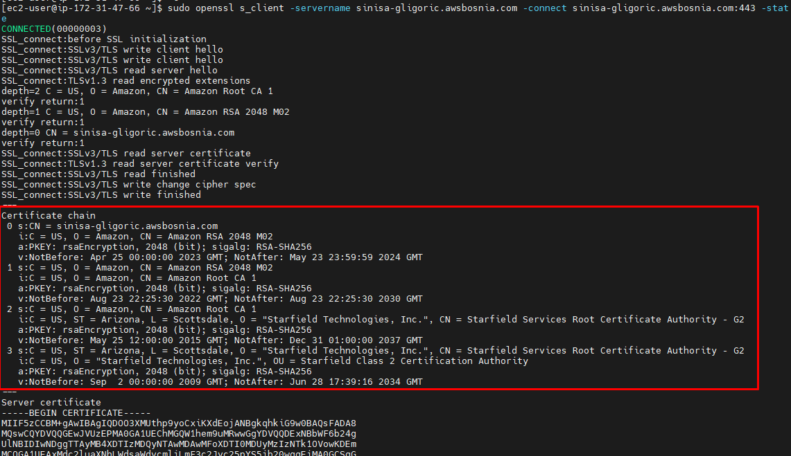

# week-9-lets-encrypt-aws-acm
### Notes below are captured during solving TASK-8: Implement SSL Let's Encrypt, migrate to AWS ACM
----------------------------------------------------------------------------------

1. Launched instance `ec2-sinisa-gligoric-task-8` from AMI image `ami-sinisa-gligoric-web-server` and ensured that instance is working properly. Accessed NGINX-NodeJS app through browser via public IP of EC2 instance and verified that app is accessible.

2. Created security group `sec-group-sinisa-gligoric-web-server` and added two inbound rules to allow SSH and HTTP.

3. After I have installed and configured [AWS CLI](https://docs.aws.amazon.com/cli/latest/userguide/getting-started-install.html), I have configured named profile `aws-bosnia` and specified access key, region and default output format for that named profile by running following command `aws configure --profile aws-bosnia`. 

4. Created DNS A record `sinisa-gligoric.awsbosnia.com` inside Hosted Zone `awsbosnia.com` with `Hosted Zone ID: Z3LHP8UIUC8CDK` through access credentials inside named profile `aws-bosnia` located at `~/.aws/credentials`, by executing following command:
* `aws route53 change-resource-record-sets --hosted-zone-id Z3LHP8UIUC8CDK --change-batch '{"Changes":[{"Action":"CREATE","ResourceRecordSet":{"Name":"sinisa-gligoric.awsbosnia.com.","Type":"A","TTL":60,"ResourceRecords":[{"Value":"18.194.118.24"}]}}]}' --profile aws-bosnia`.



5. Verify that DNS A record is propagated correctly via following command:
* `aws route53 list-resource-record-sets --hosted-zone-id Z3LHP8UIUC8CDK  --profile aws-bosnia | jq '.ResourceRecordSets[] | select(.Name == "sinisa-gligoric.awsbosnia.com." and .Type == "A") | {Name, Type, TTL, Value}'`.



6. Installed and generated Let's Encrypt certificate via certbot by executing following commands from [here](https://certbot.eff.org/instructions?ws=nginx&os=pip).
```
sudo dnf install python3 augeas-libs -y -> Install system dependencies
sudo python3 -m venv /opt/certbot/ -> Set up a Python virtual environment
sudo /opt/certbot/bin/pip install --upgrade pip
sudo /opt/certbot/bin/pip install certbot certbot-nginx -> Install Certbot
sudo ln -s /opt/certbot/bin/certbot /usr/bin/certbot -> Link certbot to /usr/bin/certbot
sudo certbot certonly --nginx -> Get a certificate
```

7. The output of the previous command should print key and certificate location like below:
```
Certificate is saved at: /etc/letsencrypt/live/sinisa-gligoric.awsbosnia.com/fullchain.pem
Key is saved at:         /etc/letsencrypt/live/sinisa-gligoric.awsbosnia.com/privkey.pem
```
 
8. Set up automatic renewal of Let's Encrypt certificate by executing following command:
* `echo "0 0,12 * * * root /opt/certbot/bin/python -c 'import random; import time; time.sleep(random.random() * 3600)' && sudo certbot renew -q" | sudo tee -a /etc/crontab > /dev/null`

9. Configure nginx configuration file to listen on HTTPS port 443 with previously generated certificates:
```
server {
  listen 80;
  server_name sinisa-gligoric.awsbosnia.com;
  return 301 https://$server_name$request_uri;
}

server {
  listen 443 ssl;
  server_name sinisa-gligoric.awsbosnia.com;

  ssl_certificate /etc/letsencrypt/live/sinisa-gligoric.awsbosnia.com/fullchain.pem;
  ssl_certificate_key /etc/letsencrypt/live/sinisa-gligoric.awsbosnia.com/privkey.pem;

  location / {
    proxy_pass http://127.0.0.1:8008;
    proxy_http_version 1.1;
    proxy_set_header Upgrade $http_upgrade;
    proxy_set_header Connection 'upgrade';
    proxy_set_header Host $host;
    proxy_cache_bypass $http_upgrade;
  }
}

```
`sudo nginx -t && sudo nginx -s reload` - Test nginx configuration and reload service

10. Added inbound rule to security group `sec-group-sinisa-gligoric-web-server` to allow port HTTPS and successfully opened web app via https://sinisa-gligoric.awsbosnia.com. 


11. Tested certificate validation via openssl command:
* `sudo openssl s_client -servername sinisa-gligoric.awsbosnia.com -connect sinisa-gligoric.awsbosnia.com:443 -state`



12. Imported Let's Encrypt SSL certificate into AWS Certificate Manager:


13. Created Application Load Balancer `alb-sinisa-gligoric-task-8`. Also created new security group `sec-group-alb-sinisa-gligoric-task-8` and added inbound rule to allow HTTP and HTTPS traffic from anywhere. After that, edited inbound rule of security group `sec-group-sinisa-gligoric-web-server` to allow HTTP only from `alb-sinisa-gligoric-task-8` instead from `anywhere`. Created HTTPS listener and bind HTTPS to imported Let's Encrypt SSL certificate. Created target group `tg-sinisa-gligoric-week-8`, added currently running EC2 instance `ec2-sinisa-gligoric-task-8` and mapped target group to load balancer HTTPS listener with default action `Forward to target group: tg-sinisa-gligoric-week-8` through HTTP port.  



14. Before upserting DNS CNAME record so that sinisa-gligoric.awsbosnia.com point to ALB public DNS name, we have to delete currently configured A record for sinisa-gligoric.awsbosnia.com:
* `aws route53 change-resource-record-sets --hosted-zone-id Z3LHP8UIUC8CDK --change-batch '{"Changes":[{"Action":"DELETE","ResourceRecordSet":{"Name":"sinisa-gligoric.awsbosnia.com","Type":"A","TTL":60,"ResourceRecords":[{"Value":"18.194.118.24"}]}}]}' --profile aws-bosnia`
* `aws route53 change-resource-record-sets --hosted-zone-id Z3LHP8UIUC8CDK --change-batch '{"Changes":[{"Action":"UPSERT","ResourceRecordSet":{"Name":"sinisa-gligoric.awsbosnia.com","Type":"CNAME","TTL":60,"ResourceRecords":[{"Value":"alb-sinisa-gligoric-task-8-1330824165.eu-central-1.elb.amazonaws.com"}]}}]}' --profile aws-bosnia` 

15. Returned to default nginx configuration to listen on port 80:
```
server {
  listen 80;
  server_name sinisa-gligoric.awsbosnia.com;

  location / {
    proxy_pass http://127.0.0.1:8008;
    proxy_http_version 1.1;
    proxy_set_header Upgrade $http_upgrade;
    proxy_set_header Connection 'upgrade';
    proxy_set_header Host $host;
    proxy_cache_bypass $http_upgrade;
  }
}
```


Tested certificate validation via openssl command:
* `sudo openssl s_client -servername sinisa-gligoric.awsbosnia.com -connect sinisa-gligoric.awsbosnia.com:443 -state`


16. Created Amazon issued SSL certificate and verified ownership of domain name via DNS challenge:
* `aws route53 change-resource-record-sets --hosted-zone-id Z3LHP8UIUC8CDK --change-batch '{"Changes":[{"Action":"CREATE","ResourceRecordSet":{"Name":"_bf97f5b57edb4bcc59ba3036fef99bb3.sinisa-gligoric.awsbosnia.com.","Type":"CNAME","TTL":60,"ResourceRecords":[{"Value":"_bf4a526edfc1deaa7265bba958a21281.tctzzymbbs.acm-validations.aws."}]}}]}' --profile aws-bosnia`





17. Created AMI image `ami-ec2-sinisa-gligoric-task-8` and will terminate resources used in this task.

### END

